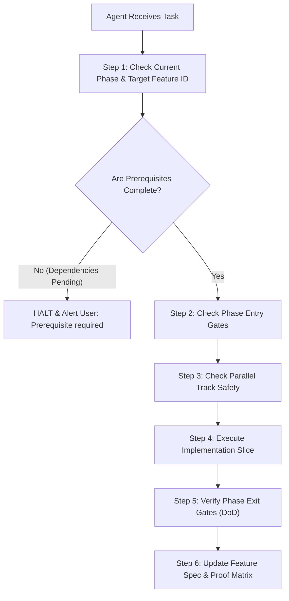

# Implementation Sequence & Phased Execution Skill

This skill guides AI agents and engineers in executing feature development across the Mosque Platform in the correct **chronological phase order**, identifying **safe parallel execution tracks**, enforcing **phase entry/exit gates**, and maintaining **strict Feature ID stability**.

---

## 1. Fundamental Rule: Dependency Map vs. Implementation Sequence

When planning or building features, agents must strictly observe the conceptual distinction:

1. **Dependency Map (`FEATURE-DEPENDENCY-MAP.md`)**:
   - Represents the mathematical prerequisite graph (DAG).
   - Answers: *"Can this feature compile and run without breaking foreign keys or migrations?"*
   - Example: If both feature A and feature B are required for feature C ($A \to C$, $B \to C$), C cannot run until both A and B exist.

2. **Implementation Sequence (`IMPLEMENTATION-SEQUENCE.md`)**:
   - Represents the chronological roadmap, phase packaging, and parallel work scheduling.
   - Answers: *"What do we build first, what can be built simultaneously, and what gates must be verified before moving to the next phase?"*
   - Continuing the example: Since A and B have no dependencies on each other, they are assigned to **concurrent execution tracks** in the same phase and built in parallel.

3. **Golden Invariant: Feature IDs Remain Strictly Stable**:
   - `F-001`, `F-002`, `F-004`, `F-010`, etc., are **permanent identifiers**.
   - Even if sprint schedules or phase definitions shift, **never rename or renumber a Feature ID**.

---

## 2. Canonical Phase Sequence & Feature Mapping

| Phase | Title | Stable Feature IDs | Primary Focus | Concurrent Tracks |
| :---: | :--- | :--- | :--- | :---: |
| **0** | **Engineering Foundation** | `F-001` `F-011` | Database (PostgreSQL + PostGIS), Prisma schema build, config validation, logging, `/health/live`, `/health/ready` | **Track 0-A** (DB/Prisma) **Track 0-B** (Observability) |
| **1** | **Identity & Access Control** | `F-002` `F-003` | User model, password hashing, JWT access/refresh tokens, brute-force limits, RBAC roles (`user`, `moderator`, `admin`), `PermissionsGuard` | **Track 1-A** (Auth) **Track 1-B** (RBAC) |
| **2** | **Core Mosque Domain** | `F-004` | Sovereign `Mosque` entity, PostGIS spatial coordinates, 100m proximity duplicate check, Add Mosque modal, Mosque Profile page | **Track 2-A** (Core Entity) |
| **3** | **Discovery & Presentation** | `F-005` `F-009` | PostGIS `ST_DWithin` radial search, text search, SSR-safe Leaflet map wrapper (`ssr: false`), viewport bounding, geolocation fallback | **Track 3-A** (Nearby API) **Track 3-B** (Map UI) |
| **4** | **Trusted Mosque Info** | `F-007` `F-010` | Daily prayer schedules, atomic jamaat update audit log, countdown banner, moderation state machine (`UNVERIFIED` $\to$ `VERIFIED`), admin console | **Track 4-A** (Prayer) **Track 4-B** (Verification) |
| **5** | **Community & Feedback** | `F-006` `F-008` `F-012` | Crowdsourced suggestions/complaints, idempotent daily attendance tracking, mosque community notices and contact info | **Track 5-A** (Suggestions) **Track 5-B** (Attendance) **Track 5-C** (Community) |
| **6** | **Governance & Amenities (R2)**| `F-020` `F-021` `F-022` `F-023` | Staff delegation & role claims (Mutawalli/Imam), facilities taxonomy, official announcements, volunteer roster | **Track 6-A** (Delegation) **Track 6-B** (Facilities) **Track 6-C** (Announcements) **Track 6-D** (Volunteers) |

---

## 3. Agent Execution Protocol

When assigned a task to implement, refactor, or audit a feature:

### Step 1: Pre-Execution Phase & Prerequisite Check
1. Read the feature specification in `_doc/mosque-platform-production-docs/specs/<feature>/<feature>.md`.
2. Inspect the `depends_on` list in the YAML frontmatter.
3. Confirm that all prerequisite features have `status: completed` in `specs/README.md`.
4. If a prerequisite is missing, **DO NOT START** building the downstream feature. Advise the user of the blocking phase.

### Step 2: Validate Phase Entry Gates
Before opening code files, verify that the entry criteria for the target phase are met:
- **Phase 0 $\to$ Phase 1**: PostgreSQL container is running, PostGIS is active, env validation works.
- **Phase 1 $\to$ Phase 2**: User entity and token issuance exist so creator actor can be resolved.
- **Phase 2 $\to$ Phase 3**: `Mosque` entity exists with valid PostGIS spatial index.
- **Phase 2 $\to$ Phase 4**: `Mosque.id` is stable to support `PrayerSchedule` and verification state.
- **Phase 2 $\to$ Phase 5**: `Mosque.id` and `User.id` exist for composite keys in `UserMosqueAttendance`.

### Step 3: Check Parallel Track Safety
If multiple features within the phase are in-progress:
- Consult the **Parallel Execution Matrix** in `IMPLEMENTATION-SEQUENCE.md`.
- **Safe in Parallel**: Features with isolated Prisma models and separate endpoints (e.g., `F-005 Nearby Search` vs `F-009 Map Discovery UI`, or `F-006 Suggestions` vs `F-008 Attendance`).
- **Unsafe in Parallel**: Multiple features editing the same Prisma model migrations concurrently (e.g. `F-020` and `F-021` both altering `Mosque`).

### Step 4: Verify Phase Exit Gates (Definition of Done)
A feature or phase is only finished when:
- Backend: Validation pipe, authorization guard, structured logging, and unit/integration tests pass.
- Frontend: SSR safety guaranteed (`ssr: false` for Leaflet/browser APIs), accessible form controls, loading and error states handled.
- Schema: Migrations replay without manual repair; no raw `prisma db push` used in production.

### Step 5: Update Proof Matrix
1. Mark completed checkboxes (`[x]`) in the feature's specification file.
2. Record concrete file paths under the task ticket in the spec.
3. Update `specs/README.md` and `06-IMPLEMENTATION-CHECKLIST.md`.

---

## 4. Conflict Avoidance Quick Reference

| Attempting to build... | Simultaneously with... | Permitted? | Rule |
| :--- | :--- | :---: | :--- |
| `F-001 (DB Foundation)` | Any other feature | ❌ **NO** | DB base migrations must finish and freeze before any domain feature starts. |
| `F-005 (Nearby Search API)` | `F-009 (Map UI)` | ✅ **YES** | Decoupled by REST DTO contract (`/api/v1/mosques/nearby`). |
| `F-007 (Prayer Schedules)` | `F-010 (Verification)` | ✅ **YES** | Separate tables (`PrayerSchedule` vs `Mosque.verificationStatus`). |
| `F-006 (Suggestions)` | `F-008 (Attendance)` | ✅ **YES** | Different tables (`MosqueSuggestion` vs `UserMosqueAttendance`). |
| `F-020 (Staff Delegation)` | `F-021 (Facilities)` | ⚠️ **COORDINATE** | Both introduce new fields or relations to `Mosque`. Coordinate migration ordering. |

---

## 5. Traceability References

- **Implementation Sequence Document**: [_doc/mosque-platform-production-docs/IMPLEMENTATION-SEQUENCE.md](../../_doc/mosque-platform-production-docs/IMPLEMENTATION-SEQUENCE.md)
- **Dependency Map (DAG)**: [_doc/mosque-platform-production-docs/FEATURE-DEPENDENCY-MAP.md](../../_doc/mosque-platform-production-docs/FEATURE-DEPENDENCY-MAP.md)
- **Production Checklist**: [_doc/mosque-platform-production-docs/06-IMPLEMENTATION-CHECKLIST.md](../../_doc/mosque-platform-production-docs/06-IMPLEMENTATION-CHECKLIST.md)
- **Release Plan**: [_doc/mosque-platform-production-docs/07-RELEASE-PLAN.md](../../_doc/mosque-platform-production-docs/07-RELEASE-PLAN.md)
- **Feature Specs & Proof Matrix**: [_doc/mosque-platform-production-docs/specs/README.md](../../_doc/mosque-platform-production-docs/specs/README.md)
