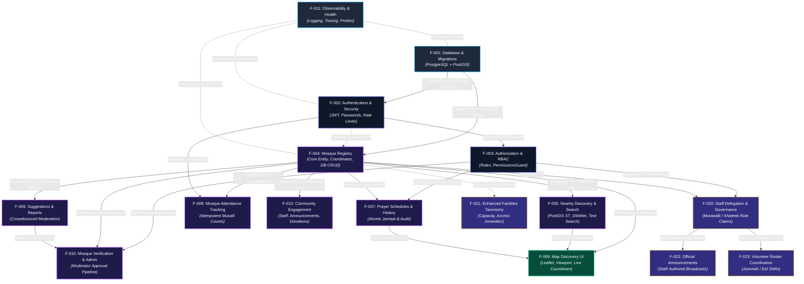

# Feature Dependency & Evolution Map (DAG)

> **Important Conceptual Boundary**: This document is **NOT** an implementation order or project roadmap.  
> It is an **Architectural Build, Persistence, and Evolutionary Dependency Graph (DAG)**. It maps:
> *If feature A changes, breaks, or migrates, what downstream features are affected? If feature B is scheduled for development, what MUST already be deployed, indexed, and stable?*
>
> 🚀 For the **phased chronological implementation plan, parallel development tracks, and stage gates**, see [IMPLEMENTATION-SEQUENCE.md](IMPLEMENTATION-SEQUENCE.md).

---

## 1. Visual Dependency Graph (Mermaid DAG)

---

## 2. Topological Execution & Dependency Order

If this platform had to be compiled and migrated from zero on an empty PostgreSQL database, it MUST strictly execute in this topological order:

| Wave / Tier | Feature ID & Title | Prerequisite (Depends On) | Why this tier position is mandatory |
| :--- | :--- | :--- | :--- |
| **Tier 0 (Foundation)** | `F-001: Database & Migrations` `F-011: Observability & Health` | *(None)* | PostgreSQL extensions (`postgis`), Prisma base client, and request correlation IDs must exist before any domain table or logger starts. |
| **Tier 1 (Identity & Core Registry)** | `F-002: Authentication & Security` `F-004: Mosque Registry` | `F-001` | `User` and `Mosque` are the two sovereign entities that anchor all foreign keys in the platform. They can be created in parallel. |
| **Tier 2 (Access Control & Core Services)** | `F-003: Authorization & RBAC` `F-005: Nearby Discovery & Search` `F-007: Prayer Schedules & History` | `F-002` (for RBAC) `F-004` (for Nearby & Prayer) | `PermissionsGuard` requires user tokens. Nearby queries require the PostGIS spatial column. Prayer schedules require `Mosque.id`. |
| **Tier 3 (Community & Moderation)** | `F-006: Suggestions & Reports` `F-008: Attendance Tracking` `F-010: Mosque Verification` `F-012: Community Operations` | `F-003, F-004, F-006` | Verification modifies `Mosque` status and requires admin RBAC (`F-003`). Attendance requires `User` + `Mosque` composite key (`F-002, F-004`). |
| **Tier 4 (Presentation Layer)** | `F-009: Map Discovery UI` | `F-004, F-005, F-007` | Dynamic frontend Leaflet client consumes endpoints from Mosque, Nearby search, and Prayer countdown simultaneously. |
| **Tier 5 (Release 2 Trunk)** | `F-020: Staff Delegation & Governance` `F-021: Facilities Taxonomy` `F-022: Announcements` `F-023: Volunteer Roster` | `F-001..F-004`, `F-020` | Extends `Mosque` and `User` with delegated role matrices and permission-scoped administration. |

---

## 3. Brutal Honest Architecture Realities & Vulnerabilities

### Reality 1: The "Mosque Registry Gravity Well" (Single Point of Domain Contention)
`F-004 (Mosque Registry)` is the gravitational center of the entire codebase. 
- **The Risk**: **8 out of 12 features** have a hard foreign key (`mosqueId`) pointing to `Mosque.id`.
- **The Vulnerability**: If an engineer or agent carelessly changes `Mosque` columns, renames fields, or alters index strategies, it triggers migration cascade breaks across `PrayerSchedule`, `Attendance`, `Suggestions`, `Staff`, and `NearbySearch`.
- **Engineering Invariant**: The `Mosque` model schema must be treated as **additive-only**. Never drop or rename columns without a multi-phase deprecation cycle.

### Reality 2: Database Monolith Connection Contention
There is no Redis or external caching tier (by deliberate architectural design per [ADR-008](file:///_doc/mosque-platform-production-docs/ADRs/ADR-008-infrastructure-stack-and-mongoose-removal.md)).
- **The Risk**: All features share the exact same PostgreSQL connection pool.
- **The Vulnerability**: If a user runs an unindexed heavy spatial radial search (`F-005 Nearby`) during Jummah peak hours, that spatial query holds PostgreSQL worker threads, which can directly starve write transactions for `F-008 (Attendance)` or `F-007 (Prayer updates)`.
- **Mitigation**: Spatial queries MUST be strictly bounded (`radius <= 50000m`, `limit <= 100`) and use the `GiST` index on coordinates.

### Reality 3: Asymmetric Auth Coupling
- Creating a mosque (`F-004`) has a **soft dependency** on Auth: guests can create mosques (`createdById = null`), while logged-in users get author credit.
- But Verifying a mosque (`F-010`) has a **hard cryptographic dependency** on `F-003 (RBAC)`: only a valid JWT with `role: admin | moderator` can trigger the state machine.
- If Auth fails, public browsing works, but moderation completely halts.

### Reality 4: The Leaflet UI Hydration Trap
`F-009 (Map Discovery UI)` is an aggregation leaf. It depends on `F-004`, `F-005`, and `F-007`.
- **The Gotcha**: Leaflet relies on browser `window` and `navigator`. Because Next.js renders on the server by default, any direct import without `next/dynamic` (`ssr: false`) will crash the entire site.
- **The Invariant**: All map components must remain strictly client-side dynamic wrappers with fallback skeleton loaders.

---

## 4. Parallel Development Matrix (What can be built safely at the same time?)

When working with AI agents or multiple branches, use this matrix to prevent Git merge hell and Prisma schema collisions:

| Feature A | Feature B | Safe to develop in parallel? | Rationale |
| :--- | :--- | :---: | :--- |
| `F-002: Authentication` | `F-004: Mosque Registry` | ✅ **SAFE** | Completely orthogonal domain tables (`User` vs `Mosque`). |
| `F-005: Nearby Search` | `F-007: Prayer Schedules` | ✅ **SAFE** | `Nearby` reads coordinates; `Prayer` mutates waqt times. Zero table overlap. |
| `F-008: Attendance` | `F-006: Suggestions` | ✅ **SAFE** | Different junction tables (`UserMosqueAttendance` vs `MosqueSuggestion`). |
| `F-020: Staff Delegation` | `F-021: Facilities Taxonomy` | ⚠️ **CONFLICT RISK** | Both alter the `Mosque` entity or add migrations. Must coordinate migration timestamp sequence. |
| `F-009: Map UI` | Any Backend Feature | ✅ **SAFE** | Decoupled by REST API contract DTOs. |
| `F-001: DB Migrations` | Any other feature | ❌ **UNSAFE** | Base migrations must be finalized and committed before modifying schema. |

---

## 5. Traceability to Production PRD & Standards

- **PRD Foundation**: [01-PRD-PRODUCTION.md](file:///_doc/mosque-platform-production-docs/01-PRD-PRODUCTION.md)
- **System Boundaries & Modular Monolith**: [02-SYSTEM-ARCHITECTURE.md](file:///_doc/mosque-platform-production-docs/02-SYSTEM-ARCHITECTURE.md)
- **Data Model & REST Contracts**: [03-DATA-API-CONTRACTS.md](file:///_doc/mosque-platform-production-docs/03-DATA-API-CONTRACTS.md)
- **Implementation Sequence & Phases**: [IMPLEMENTATION-SEQUENCE.md](file:///_doc/mosque-platform-production-docs/IMPLEMENTATION-SEQUENCE.md)
- **Release Staging**: [07-RELEASE-PLAN.md](file:///_doc/mosque-platform-production-docs/07-RELEASE-PLAN.md)
- **Specs & Proof Directory**: [specs/README.md](file:///_doc/mosque-platform-production-docs/specs/README.md)
