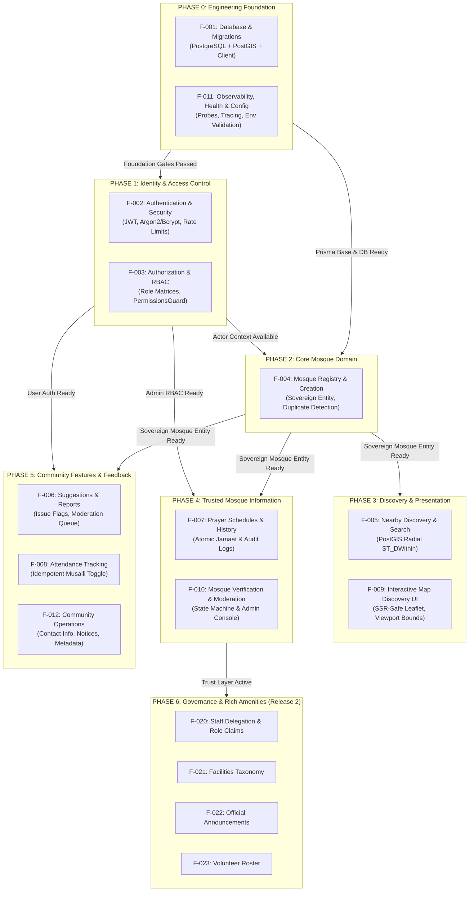

# Implementation Sequence & Phased Execution Plan

> **Core Conceptual Distinction**:  
> **Dependency Map (DAG) ≠ Implementation Sequence**.  
> - A **Dependency Map** (see [FEATURE-DEPENDENCY-MAP.md](FEATURE-DEPENDENCY-MAP.md)) specifies mathematical prerequisite constraints: *If C depends on A and B ($A \to C$, $B \to C$), neither A nor B can be omitted before C is deployed.*  
> - An **Implementation Sequence** organizes feature delivery into **actionable chronologic phases and parallel execution tracks**: *Since A and B both depend only on the foundation, they can be implemented concurrently by independent engineers or agents in Phase 1, long before C is tackled in Phase 2.*
>
> **Golden Invariant**: **Feature IDs remain strictly stable**. Even if business priorities, sprint goals, or implementation sequencing change, `F-001`, `F-004`, `F-010`, etc., never change their identifiers.

---

## 1. High-Level Phase Overview & Pipeline

The implementation sequence moves from **Infrastructure Foundation** up through **Core Sovereign Entity**, **Discovery UI**, **Trust & Verification**, and **Community Expansion**.



---

## 2. Phase-by-Phase Execution Plan

### PHASE 0 — Engineering Foundation
> **Goal**: Establish durable database persistence, spatial query capabilities, startup configuration validation, and zero-downtime health observability before any business logic is written.

| Feature ID | Feature Name | Primary Focus | Concurrent Track | Spec Link |
| :--- | :--- | :--- | :---: | :--- |
| **F-001** | Database Architecture & Migrations | PostgreSQL + PostGIS, modular Prisma schema, baseline migrations | **Track 0-A** | [database-migrations.md](specs/database-migrations/database-migrations.md) |
| **F-011** | Observability, Health & Reliability | Startup env validation, structured logger, correlation IDs, `/health/live`, `/health/ready` | **Track 0-B** | [observability-health.md](specs/observability-health/observability-health.md) |

#### Concurrency & Parallel Execution
- `F-001` and `F-011` can be developed **in parallel**. `F-011` implements NestJS interceptors and Terminus probes, while `F-001` sets up Docker PostGIS and Prisma schema builders.

#### Phase Entry Gates
- Docker PostgreSQL + PostGIS container is runnable.
- Node.js / NestJS and Next.js environments are initialized.

#### Phase Exit Gates (Definition of Done)
- [x] Database migrations execute cleanly on a fresh PostgreSQL instance.
- [x] PostGIS extension (`CREATE EXTENSION IF NOT EXISTS postgis;`) is confirmed enabled.
- [x] `GET /health/live` returns `200 OK` without DB dependency.
- [x] `GET /health/ready` validates database connectivity and returns `503` if DB is down.
- [x] Server fails fast at startup if required environment variables are absent.

---

### PHASE 1 — Identity & Access Control
> **Goal**: Implement credential security, token issuance, server-derived actor resolution, and role-based guards.

| Feature ID | Feature Name | Primary Focus | Concurrent Track | Spec Link |
| :--- | :--- | :--- | :---: | :--- |
| **F-002** | Authentication & Credential Security | User entity, Argon2/Bcrypt hashing, JWT access/refresh lifecycle, brute-force rate limiter | **Track 1-A** | [authentication-security.md](specs/authentication-security/authentication-security.md) |
| **F-003** | Authorization & RBAC | Role enumeration (`guest`, `user`, `moderator`, `admin`), `RolesGuard`, server actor derivation | **Track 1-B** | [authorization-rbac.md](specs/authorization-rbac/authorization-rbac.md) |

#### Concurrency & Parallel Execution
- Sequential or tightly coupled: `F-002` establishes the JWT token payload and User table. `F-003` consumes the validated JWT payload to enforce role permissions. `F-003` can start as soon as the JWT payload contract is frozen.

#### Phase Entry Gates
- Phase 0 complete: `User` model migration applied in Prisma.

#### Phase Exit Gates (Definition of Done)
- [x] Registration and login return signed, short-lived JWTs.
- [x] Passwords hashed with strong salt; zero passwords in logs.
- [x] `PermissionsGuard` blocks unauthorized access with `403 Forbidden`.
- [x] Privileged roles cannot be spoofed by client payload (actor derived strictly from server JWT context).

---

### PHASE 2 — Core Mosque Domain (The Sovereign Registry)
> **Goal**: Establish the central sovereign entity (`Mosque`), spatial coordinate storage, address normalization, and duplicate proximity detection.

| Feature ID | Feature Name | Primary Focus | Concurrent Track | Spec Link |
| :--- | :--- | :--- | :---: | :--- |
| **F-004** | Mosque Registry & Creation | `Mosque` entity, PostGIS `geometry(Point, 4326)`, duplicate detection API, Add Mosque pin modal, Mosque Profile view | **Track 2-A** | [mosques-registry.md](specs/mosques-registry/mosques-registry.md) |

#### Concurrency & Parallel Execution
- **Gravity Well Notice**: `F-004` is the anchor for 8 downstream features. Schema design must be finalized before Phase 3 and Phase 4 branch out.
- Frontend pin-drop UI modal and Backend duplicate check API can be developed concurrently using mock DTO contracts.

#### Phase Entry Gates
- Phase 0 complete (PostGIS active).
- Phase 1 complete (optional creator actor association).

#### Phase Exit Gates (Definition of Done)
- [x] Mosque creation stores precise WGS84 lat/lng in PostGIS geometry column.
- [x] Spatial GiST index created on `Mosque.coordinates`.
- [x] Proximity duplicate check flags existing mosques within 100 meters.
- [x] Mosque profile page `/mosques/:id` renders SSR-safely with canonical metadata.

---

### PHASE 3 — Discovery & Presentation
> **Goal**: Enable users to discover registered mosques via radial distance queries, full-text search, and an interactive, SSR-safe map interface.

| Feature ID | Feature Name | Primary Focus | Concurrent Track | Spec Link |
| :--- | :--- | :--- | :---: | :--- |
| **F-005** | Nearby Discovery & Search | PostGIS `ST_DWithin` radial API, text search by mosque name/area, query bounding limits | **Track 3-A** | [nearby-search.md](specs/nearby-search/nearby-search.md) |
| **F-009** | Interactive Map Discovery UI | Next.js Leaflet client wrapper (`ssr: false`), viewport coordinate debounce, cluster markers, fallback state | **Track 3-B** | [map-discovery-ui.md](specs/map-discovery-ui/map-discovery-ui.md) |

#### Concurrency & Parallel Execution
- `F-005` (Backend Search API) and `F-009` (Frontend Map UI) are **completely orthogonal** and should be developed **in parallel**.
- They integrate cleanly through the `GET /api/v1/mosques/nearby?lat=...&lng=...&radius=...` REST contract.

#### Phase Entry Gates
- Phase 2 complete (`Mosque` table populated with spatial coordinates and GiST index).

#### Phase Exit Gates (Definition of Done)
- [x] Radial query uses PostGIS spatial indexing (`< 50ms` execution for 10,000 pins).
- [x] Search bounds enforced (max radius `50,000m`, max limit `100`).
- [x] Leaflet map loads dynamically without Next.js SSR hydration errors.
- [x] Geolocation permission denial gracefully falls back to default city center.

---

### PHASE 4 — Trusted Mosque Information & Moderation
> **Goal**: Add daily prayer schedules, jamaat change audit history, and moderator verification workflows to turn raw registrations into verified community assets.

| Feature ID | Feature Name | Primary Focus | Concurrent Track | Spec Link |
| :--- | :--- | :--- | :---: | :--- |
| **F-007** | Prayer Schedules & History | `PrayerSchedule` model, atomic jamaat update transaction, history audit log, live countdown UI | **Track 4-A** | [prayer-schedules.md](specs/prayer-schedules/prayer-schedules.md) |
| **F-010** | Mosque Verification & Moderation | Verification state machine (`UNVERIFIED`, `VERIFIED`, `REJECTED`), admin dashboard, moderation queue | **Track 4-B** | [mosque-verification.md](specs/mosque-verification/mosque-verification.md) |

#### Concurrency & Parallel Execution
- `F-007` and `F-010` touch separate tables (`PrayerSchedule` vs `Mosque.verificationStatus`) and can be implemented **in parallel**.
- `F-010` enforces `F-003` RBAC (`admin` / `moderator` roles only).

#### Phase Entry Gates
- Phase 1 complete (`F-003` RBAC guards active).
- Phase 2 complete (`F-004` `Mosque.id` available for foreign keys).

#### Phase Exit Gates (Definition of Done)
- [x] Prayer schedule update records delta in `PrayerScheduleHistory` in a single atomic transaction.
- [x] Live prayer banner dynamically calculates time until next Waqt/Jamaat.
- [x] Unverified mosques cannot be marked verified except through the authorized admin moderation endpoint.
- [x] State transitions are idempotent and logged in `AuditLog`.

---

### PHASE 5 — Community Engagement & User Feedback
> **Goal**: Enable congregants to log daily attendance, report discrepancies or inaccurate schedules, and submit community suggestions.

| Feature ID | Feature Name | Primary Focus | Concurrent Track | Spec Link |
| :--- | :--- | :--- | :---: | :--- |
| **F-006** | Crowdsourced Suggestions & Reports | Mosque correction submissions, issue categorization, integration with admin moderation queue | **Track 5-A** | [suggestions-reports.md](specs/suggestions-reports/suggestions-reports.md) |
| **F-008** | Mosque Attendance Tracking | `UserMosqueAttendance` composite key, idempotent daily prayer check-in, aggregate counts | **Track 5-B** | [attendance-tracking.md](specs/attendance-tracking/attendance-tracking.md) |
| **F-012** | Community Operations | Mosque notices, management contact details, social links | **Track 5-C** | [community-engagement.md](specs/community-engagement/community-engagement.md) |

#### Concurrency & Parallel Execution
- All three features (`F-006`, `F-008`, `F-012`) operate on distinct models and endpoints. They are **100% parallelizable** across different agents or branches.

#### Phase Entry Gates
- Phase 1 complete (`F-002` user authentication for attendance and suggestions).
- Phase 2 complete (`F-004` `Mosque.id` foreign key targets).

#### Phase Exit Gates (Definition of Done)
- [x] Attendance toggling is idempotent (`UPSERT` on `userId + mosqueId + date + waqt`).
- [x] Suggestion submission is rate-limited to avoid spam.
- [x] Verified complaints automatically flag the mosque in the moderation dashboard (`F-010`).

---

### PHASE 6 — Governance, Delegation & Rich Amenities (Release 2 Trunk)
> **Goal**: Transition from central moderation to distributed local mosque governance (Mutawalli, Imam, Khatib), enriched facility taxonomies, and community announcements.

| Feature ID | Feature Name | Primary Focus | Concurrent Track | Spec Link |
| :--- | :--- | :--- | :---: | :--- |
| **F-020** | Staff Delegation & Governance | Mosque-scoped role claims, verification proof upload, mutawalli administrative console | **Track 6-A** | [specs/README.md#f-020](specs/README.md) |
| **F-021** | Facilities & Accessibility Taxonomy | Capacity counters, wudu facilities, women's prayer area, wheelchair ramp, janaza facilities | **Track 6-B** | [specs/README.md#f-021](specs/README.md) |
| **F-022** | Official Mosque Announcements | Staff broadcasts, Jumu'ah khutbah topics, emergency announcements | **Track 6-C** | [specs/README.md#f-022](specs/README.md) |
| **F-023** | Volunteer Roster Coordination | Jummah security, Ramadan iftar shifts, Eid prayer logistics | **Track 6-D** | [specs/README.md#f-023](specs/README.md) |

#### Concurrency & Parallel Execution
- `F-020` MUST precede `F-022` and `F-023` because announcements and volunteer coordination require verified mosque-scoped staff authorization.
- `F-021` (Facilities taxonomy) can be built in parallel with `F-020`.

---

## 3. Parallel Execution Matrix (Cross-Phase Tracks)

This matrix defines what can be executed at the exact same time without merge conflicts or database race conditions:

```
Timeline ─────────────────────────────────────────────────────────────►
Phase 0 │ ──[ F-001: DB & PostGIS ]──┐
        │ ──[ F-011: Observability ]──┴──► Phase 0 Exit Gate
Phase 1 │ ──[ F-002: Authentication ]──► [ F-003: RBAC ] ──► Phase 1 Exit Gate
Phase 2 │ ──[ F-004: Sovereign Mosque Entity & Duplicate Check ] ──► Phase 2 Exit Gate
Phase 3 │ ┌─[ F-005: Nearby PostGIS Search ]─────────┐
        │ └─[ F-009: Leaflet Client Map UI ]─────────┴──► Phase 3 Exit Gate
Phase 4 │ ┌─[ F-007: Atomic Prayer Schedule ]────────┐
        │ └─[ F-010: Moderation & State Machine ]────┴──► Phase 4 Exit Gate
Phase 5 │ ┌─[ F-006: Suggestions & Reports ]─────────┐
        │ ├─[ F-008: Attendance Tracking ]───────────┼──► Phase 5 Exit Gate
        │ └─[ F-012: Community Operations ]──────────┘
Phase 6 │ ┌─[ F-020: Staff Delegation ]──► ┌─[ F-022: Announcements ]
        │ │                                └─[ F-023: Volunteers ]
        │ └─[ F-021: Facilities Taxonomy ]
```

---

## 4. Master Feature Reference Table

The canonical registry of feature IDs across the entire repository:

| Feature ID | Canonical Name | Phase | Release | Dependencies | Safe Parallel Counterparts |
| :--- | :--- | :---: | :---: | :--- | :--- |
| **F-001** | Database Architecture & Migrations | 0 | R1 | *(None)* | `F-011` |
| **F-011** | Observability, Health & Reliability | 0 | R1 | *(None)* | `F-001` |
| **F-002** | Authentication & Security | 1 | R1 | `F-001` | `F-004` (backend only) |
| **F-003** | Authorization & RBAC | 1 | R1 | `F-001, F-002` | `F-004` |
| **F-004** | Mosque Registry & Creation | 2 | R1 | `F-001` | `F-002, F-003` |
| **F-005** | Nearby Discovery & Search | 3 | R1 | `F-001, F-004` | `F-007, F-009` |
| **F-009** | Interactive Map Discovery UI | 3 | R1 | `F-004, F-005, F-007` | `F-005, F-008` |
| **F-007** | Prayer Schedules & History | 4 | R1 | `F-001, F-004` | `F-005, F-010` |
| **F-010** | Mosque Verification & Moderation | 4 | R1 | `F-001..F-004, F-006` | `F-007` |
| **F-006** | Crowdsourced Suggestions & Reports | 5 | R1 | `F-001, F-004` | `F-008, F-012` |
| **F-008** | Mosque Attendance Tracking | 5 | R1 | `F-001, F-002, F-004` | `F-006, F-012` |
| **F-012** | Community Engagement & Operations | 5 | R1 | `F-001, F-002, F-004` | `F-006, F-008` |
| **F-020** | Staff Delegation & Role Claims | 6 | R2 | `F-001..F-004` | `F-021` |
| **F-021** | Facilities & Accessibility Taxonomy | 6 | R2 | `F-001, F-004` | `F-020` |
| **F-022** | Official Announcements Channel | 6 | R2 | `F-001, F-003, F-004, F-020` | `F-021, F-023` |
| **F-023** | Volunteer Roster Coordination | 6 | R2 | `F-001, F-004, F-020` | `F-021, F-022` |

---

## 5. Summary of Differences: Dependency Map vs. Implementation Sequence

| Dimension | Dependency Map ([FEATURE-DEPENDENCY-MAP.md](FEATURE-DEPENDENCY-MAP.md)) | Implementation Sequence ([IMPLEMENTATION-SEQUENCE.md](IMPLEMENTATION-SEQUENCE.md)) |
| :--- | :--- | :--- |
| **Core Question** | *"What code/schema must exist for this feature to compile and not violate foreign keys?"* | *"What should the team build first, second, and in parallel to deliver value systematically?"* |
| **Structure** | Directed Acyclic Graph (DAG) with nodes and parent-child edges. | Phased delivery pipeline with parallel tracks and exit gates. |
| **Primary Risk Managed** | Foreign key violations, migration sequence breakage, runtime null pointers. | Merge conflicts, idle developer blocking, uncoordinated branch work, premature feature releases. |
| **Granularity** | Table-level and service-level dependencies. | Slices, gates, sprints, and release packages. |
| **Change Frequency** | Low (only changes if domain model topology changes). | Flexible (phases can be reprioritized while keeping Feature IDs stable). |
