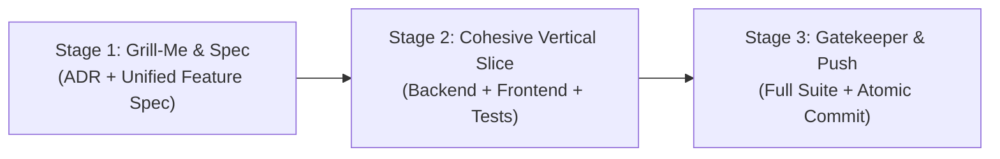

# High-Efficiency Agentic Execution Playbook (Release 2)

A lean, high-velocity prompt playbook for shipping Release 2 features with zero boilerplate, no ticket-decomposition overhead, and rigorous test-backed quality.

---

## The 3-Stage High-Efficiency Pipeline



### Why this beats enterprise bureaucracy:
1. **Zero Ticket Rot**: No redundant `tickets/*.md` files. The Feature Spec contains the single source of truth and inline checklist.
2. **Cohesive Execution**: The agent writes schema, business logic, DTOs, and tests in one coherent pass—eliminating hallucinated mock signatures and token churn.
3. **Speed to Value**: Reduces 12+ prompt roundtrips down to **3 focused prompts per feature slice**.

---

## Placeholders
- `{{FEATURE_NAME}}`: URL/directory slug (e.g. `staff-delegation`, `facility-taxonomy`, `announcements`).
- `{{FEATURE_TITLE}}`: Full feature title (e.g. `Mosque Staff Delegation & Role Claim Governance`).
- `{{ADR_NUMBER}}`: Next sequential ADR number (e.g. `ADR-009`).

---

## Stage 1: Invariant Alignment & Specification

### Prompt 1.1: Launch Grill-Me Session

```markdown
We are starting Release 2 feature slice: {{FEATURE_TITLE}} (slug: {{FEATURE_NAME}}).

Act as our Principal Systems Architect. Conduct an interactive /grill-me session, questioning me one topic at a time to pin down our exact engineering invariants before writing code:

1. Actor & Invariants: Who can claim, approve, or revoke this role/resource? What state transitions are strictly forbidden?
2. Zero-Extra-Infra Boundary: Can PostgreSQL and PostGIS handle this completely without Redis, BullMQ, or WebSockets?
3. REST Contracts & Error Envelopes: Exact endpoints, DTO fields, and failure conditions (400, 401, 403, 404, 409).
4. Storage & Spatial Indexing: Tables, columns, foreign keys, GiST/B-tree indexes, and audit logging payload.
5. Concurrency & Edge Cases: Duplicate claims, race conditions, expired credentials, or conflicting submissions.

Ask me the single most critical architectural question to begin.
```

---

### Prompt 1.2: Generate Unified Spec & ADR

```markdown
Based on our completed /grill-me alignment session for "{{FEATURE_TITLE}}":

Please generate two durable engineering artifacts following `_doc/mosque-platform-production-docs/08-PRODUCTION-ENGINEERING-STANDARD.md`:

1. ADR: `_doc/mosque-platform-production-docs/ADRs/{{ADR_NUMBER}}-{{FEATURE_NAME}}.md`
   - Context, Decision, Consequences, and why PostgreSQL/PostGIS is selected over external caches/queues.

2. Unified Feature Spec: `_doc/mosque-platform-production-docs/specs/{{FEATURE_NAME}}/{{FEATURE_NAME}}.md`
   - Section 1: Overview & Problem Statement
   - Section 2: Business Invariants & State Machine
   - Section 3: Data Model & Prisma Schema Changes (models, fields, indexes)
   - Section 4: REST API Contracts (paths, methods, DTO schemas, error responses)
   - Section 5: Security & Audit Logging (RBAC permissions, audit payload)
   - Section 6: Actionable Implementation Checklist (atomic checkboxes for backend & frontend)

Do not generate separate ticket markdown files. Keep the spec as the authoritative checklist.
```

---

## Stage 2: Cohesive Vertical-Slice Implementation

Depending on the feature scope, choose **Option A** (Full-Stack Vertical Slice in one prompt) or **Option B** (Backend slice followed by Frontend slice).

### Prompt 2.0 (Option A): Full-Stack Cohesive Implementation

```markdown
Read the feature spec at `_doc/mosque-platform-production-docs/specs/{{FEATURE_NAME}}/{{FEATURE_NAME}}.md` and the architecture rules in `backend-nest-prisma/AGENTS.md` and `frontend/AGENTS.md`.

Implement the complete vertical slice for {{FEATURE_TITLE}}:

1. Persistence & Migration:
   - Update `backend-nest-prisma/prisma/schema.prisma`.
   - Run `npx prisma migrate dev --create-only` and generate Prisma client.
   - Add necessary B-tree/GiST indexes.

2. Backend Feature Module (`backend-nest-prisma/src/features/{{FEATURE_NAME}}/`):
   - DTOs with strict `class-validator` rules.
   - Service enforcing all business invariants, state transitions, and audit logs.
   - Controller with `@UseGuards(JwtAuthGuard, RolesGuard)` or `PermissionsGuard`.
   - Unit tests covering happy paths, unauthorized attempts, invalid state transitions, and edge cases.
   - Controller integration tests verifying uniform error envelopes (400/401/403/404/409).

3. Frontend Experience (`frontend/src/`):
   - Implement pages/components adhering to Ferio design system tokens.
   - Connect typed API client calls matching the backend contract.
   - Handle loading, empty, and permission states cleanly without fake mock fallbacks.

Run `cd backend-nest-prisma && pnpm test` and `cd ../frontend && pnpm build` to verify everything compiles and passes cleanly. Check off completed items in the spec checklist.
```

---

### Prompt 2.1 (Option B — Backend Vertical Slice Only):

```markdown
Read the feature spec at `_doc/mosque-platform-production-docs/specs/{{FEATURE_NAME}}/{{FEATURE_NAME}}.md` and rules in `backend-nest-prisma/AGENTS.md`.

Implement the complete backend slice for {{FEATURE_TITLE}}:
1. Update `schema.prisma`, generate migration, and update Prisma client.
2. Implement module, DTOs with `class-validator`, service, and controller under `backend-nest-prisma/src/features/{{FEATURE_NAME}}/`.
3. Enforce business invariants, RBAC permissions, and immutable audit logging.
4. Write comprehensive unit & integration tests covering happy path and 400/401/403/404/409 error envelopes.
5. Run `pnpm test` in `backend-nest-prisma` and ensure all tests pass.
```

---

### Prompt 2.2 (Option B — Frontend Slice Only):

```markdown
Read the feature spec at `_doc/mosque-platform-production-docs/specs/{{FEATURE_NAME}}/{{FEATURE_NAME}}.md` and rules in `frontend/AGENTS.md`.

Implement the frontend slice for {{FEATURE_TITLE}}:
1. Build screens/components in `frontend/src/` matching the API contracts.
2. Follow Ferio visual design system tokens, responsive layout, and semantic markup.
3. Wire up server and client data fetching with real API contracts (no fake fallbacks on 401/403).
4. Run `cd frontend && pnpm build` and verify zero TypeScript or Next.js build errors.
```

---

## Stage 3: Gatekeeper Verification & Push

### Prompt 3.1: Full Platform Gatekeeper & Push

```markdown
We have implemented {{FEATURE_TITLE}}.

Please execute our production release gate:
1. Run full verification suite:
   - `cd backend-nest-prisma && pnpm test && pnpm test:e2e`
   - `cd ../frontend && pnpm build`
2. Architectural drift check:
   - Ensure zero uncommitted migrations or Prisma drift.
   - Ensure zero orphaned `console.log` statements.
3. Update module documentation:
   - Use the `backend-feature-readme` skill to generate/update `backend-nest-prisma/src/features/{{FEATURE_NAME}}/README.md`.
4. Git Commit & Push:
   - Use the `git-commit-push` skill to commit changes atomically with Conventional Commits (e.g. `feat({{FEATURE_NAME}}): ...`, `test({{FEATURE_NAME}}): ...`) and push to `origin/main`.
```

---

## Ready-to-Paste Kickoff Prompts for Release 2

### Option A: Mosque Staff Delegation & Role Claim Governance
> "We are starting Release 2. Feature Slice: Mosque Staff Delegation & Role Claim Governance (slug: `staff-delegation`, ADR: `ADR-009`). Please initiate the interactive /grill-me session following Stage 1 of `_doc/mosque-platform-production-docs/new-feature-planning/prompt.md`."

### Option B: Enhanced Mosque Facilities & Capacity Taxonomy
> "We are starting Release 2. Feature Slice: Enhanced Mosque Facilities & Capacity Taxonomy (slug: `facility-taxonomy`, ADR: `ADR-009`). Please initiate the interactive /grill-me session following Stage 1 of `_doc/mosque-platform-production-docs/new-feature-planning/prompt.md`."

### Option C: Volunteer Roster & Event Coordination
> "We are starting Release 2. Feature Slice: Volunteer Roster & Event Coordination (slug: `volunteer-roster`, ADR: `ADR-009`). Please initiate the interactive /grill-me session following Stage 1 of `_doc/mosque-platform-production-docs/new-feature-planning/prompt.md`."
