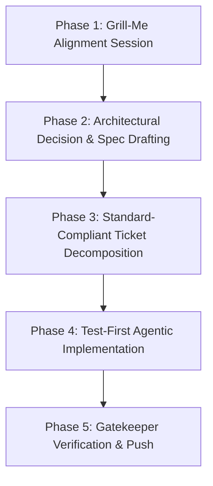

Here is the disciplined, repeatable **Agentic Coding Playbook** for Release 2, tailored specifically to your engineering standards, architecture rules, and `_doc/mosque-platform-production-docs` structure.

---

### The 5-Phase Agentic Pipeline for Release 2



---

### Phase 1: Interactive Alignment Session (`/grill-me`)

Before any agent touches code, migrations, or tickets:
1. **Identify the Release 2 Feature Slice**:
   - Pick one cohesive domain from [07-RELEASE-PLAN.md](file:///_doc/mosque-platform-production-docs/07-RELEASE-PLAN.md) (e.g., *Community Delegation & Mosque Staff Governance*, *Enhanced Facility Taxonomy*, or *Volunteer Roster Management*).
2. **Conduct the Grill-Me Session**:
   - The agent interviews you relentlessly on:
     - **Invariants**: Who is authorized? What constitutes an invalid state transition?
     - **Infra boundaries**: Can PostgreSQL/PostGIS handle this, or does it genuinely require new infrastructure?
     - **API Contracts**: What are the request/response payloads, validation rules, and error envelopes?
     - **Edge cases**: Concurrent claims, expired staff roles, geographic validation boundaries.

---

### Phase 2: ADR & Feature Specification Generation

Every feature in Release 2 must produce durable engineering artifacts before execution:

1. **Architectural Decision Record (ADR)**:
   - Place in `_doc/mosque-platform-production-docs/adrs/ADR-009-<feature-title>.md`.
   - Document: Context, Decision, Consequences, and Alternatives Considered (e.g., explaining why role claims use database polling vs. adding Redis).
2. **Feature Specification (`specs/<feature-name>/<feature-name>.md`)**:
   - Follow the established standard in [08-PRODUCTION-ENGINEERING-STANDARD.md](file:///_doc/mosque-platform-production-docs/08-PRODUCTION-ENGINEERING-STANDARD.md):
     - **Domain Model & Entities** (tables, columns, types, relations)
     - **REST Endpoints & DTOs** (exact request/response JSON schemas)
     - **Security & Authorization** (RBAC rules, audience claims, rate limits)
     - **Audit Logging Requirements** (action name, entity ID, metadata payload)

---

### Phase 3: Ticket Decomposition (Definition of Ready)

Decompose the spec into atomic tickets in `_doc/mosque-platform-production-docs/specs/<feature-name>/tickets/`:

Each ticket must contain:
1. **Target Subsystem**: Backend / Frontend / DB Migration.
2. **Invariant & Non-Goals**: Explicit constraints preventing scope creep.
3. **Acceptance Criteria**: Bulleted checklist tied to tests.
4. **Compliance Checklist**:
   - [ ] [02-SYSTEM-ARCHITECTURE.md](file:///_doc/mosque-platform-production-docs/02-SYSTEM-ARCHITECTURE.md) (module boundaries, no circular dependencies)
   - [ ] [04-SECURITY-RELIABILITY-OPERATIONS.md](file:///_doc/mosque-platform-production-docs/04-SECURITY-RELIABILITY-OPERATIONS.md) (auth, rate limits, audit log)
   - [ ] [05-TESTING-STRATEGY.md](file:///_doc/mosque-platform-production-docs/05-TESTING-STRATEGY.md) (unit + service + controller integration test)
   - [ ] [08-PRODUCTION-ENGINEERING-STANDARD.md](file:///_doc/mosque-platform-production-docs/08-PRODUCTION-ENGINEERING-STANDARD.md) (error envelope, DTO validation)

---

### Phase 4: Test-First Agentic Implementation

When instructing the agent to code a ticket:

1. **Step 1 — Schema & Persistence First**:
   - Update `schema.prisma`.
   - Generate migration (`npx prisma migrate dev --create-only`).
   - Add GiST/B-tree indexes and DB constraints directly in SQL if PostGIS/spatial columns are involved.
2. **Step 2 — Domain Invariants & Unit Tests First**:
   - Write unit tests verifying business rules, state transitions, and error throws *before* writing the service body.
3. **Step 3 — Controller, DTOs & Validation**:
   - Apply `class-validator` decorators with custom error messages.
   - Attach `@UseGuards(JwtAuthGuard, RolesGuard)` and audit logging interceptor.
4. **Step 4 — Controller Integration & Boundary Tests**:
   - Run tests against mock Prisma service / test database verifying 200/201 happy path and 400/401/403/404/409 error envelopes.
5. **Step 5 — Frontend Integration**:
   - Connect client hooks/services to the API contract.
   - Maintain Ferio design tokens, server-side data fetching, and zero fake mock fallbacks on 401/403.

---

### Phase 5: Production Verification & Push Gate

Before finalizing any ticket or feature:

1. **Run Full Verification Suite**:
   ```bash
   cd backend-nest-prisma && pnpm test && pnpm test:e2e
   cd ../frontend && pnpm build
   ```
2. **Check Architecture & Drift**:
   - Ensure no new console logs, no uncommitted migration drift, and no unauthorized packages added.
3. **Conventional Commit & Push**:
   - Use the `git-commit-push` skill to commit with atomic Conventional Commits (`feat(staff): ...`, `test(staff): ...`) and push to `origin/main`.

---

### Ready to Start Release 2?

When you are ready, choose which Release 2 slice to tackle first:
- **Option A**: **Mosque Staff Delegation & Role Claim Governance** (Ibadah committee, Khateeb, Mutawalli approval workflow).
- **Option B**: **Enhanced Mosque Facilities & Capacity Taxonomy** (Wudu facilities, women's prayer area access, wheelchair accessibility).
- **Option C**: **Volunteer Roster & Event Coordination** (Jummah crowd management, Eid prayer shifts).

Say the word and we can begin the `/grill-me` session for that feature!