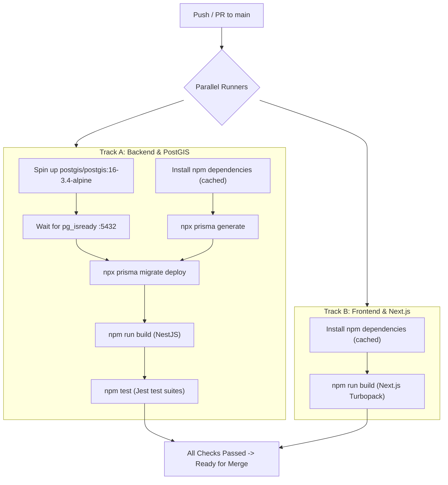

# Feature Specification: Production CI/CD Pipeline & Disposable Migration Replay (F-013)

## 1. Overview & Business Intent

In high-reliability production applications, human manual testing and local-only migration runs are unacceptable failure modes. A database migration that works on a developer's persistent local Docker container may fail on an uninitialized environment if dependencies, extension ordering, or seed constraints are flawed.

**F-013** implements an automated **Continuous Integration (CI) Pipeline** using GitHub Actions:
1. Spawns an ephemeral PostgreSQL + PostGIS service container (`postgis/postgis:16-3.4-alpine`) on every commit and pull request.
2. Validates clean replay of all historical and incremental migrations (`prisma migrate deploy`).
3. Runs the complete backend automated test suite across all 21 feature domains.
4. Concurrently compiles and validates the Next.js frontend production bundle with Turbopack.
5. Blocks any pull request or merge to `main` that introduces regressions or broken schemas.

---

## 2. Invariants & Gates

1. **Zero Uncommitted Migration Drift**: The pipeline fails if `prisma migrate deploy` encounters unapplied migrations or schema conflicts.
2. **Ephemeral PostGIS Validation**: The runner tests against a true PostGIS service container, verifying spatial types (`geometry(Point, 4326)`) and GiST index creation.
3. **No Database in Production Build**: Frontend Turbopack production builds (`npm run build`) must compile cleanly without needing a live database connection.
4. **Parallel Execution**: Backend and Frontend checks execute in independent parallel tracks to minimize developer wait time.
5. **No Leaked Secrets**: All test passwords and keys in the workflow are dummy test fixtures; production secrets are never injected into CI runners.

---

## 3. Workflow Topology

---

## 4. Implementation Slices & Proof of Completion

### TK-CICD-01: GitHub Actions CI Workflow with Ephemeral PostGIS Container
- **Status**: `[x] Completed` | **Priority**: Critical
- **Description**: Configure `.github/workflows/ci.yml` defining the matrix, service container, environment variables, and caching.
- **Acceptance Criteria**:
  - [x] GitHub Actions workflow file `.github/workflows/ci.yml` created.
  - [x] Triggers on `push` to `main` and `pull_request` targeting `main`.
  - [x] Ephemeral `postgis/postgis:16-3.4-alpine` service container configured with health checks on port 5432.
  - [x] Node.js 20 LTS environment configured with `~/.npm` dependency caching.
- **Implementation Files**:
  - Workflow: `.github/workflows/ci.yml`

### TK-CICD-02: Migration Replay Script & Automated Test Verification in CI
- **Status**: `[x] Completed` | **Priority**: Critical
- **Description**: Add pipeline steps for Prisma schema generation, `prisma migrate deploy` verification, NestJS compilation, and test suite execution.
- **Acceptance Criteria**:
  - [x] `prisma migrate deploy` executes cleanly against ephemeral PostGIS container.
  - [x] `backend-nest-prisma` build (`npm run build`) and test suites (`npm test`) execute in CI.
  - [x] `frontend` build (`npm run build`) executes in parallel CI job.
  - [x] Local simulation verifies all steps succeed without warnings or errors.
- **Implementation Files**:
  - Workflow: `.github/workflows/ci.yml`
  - Checklist: `_doc/mosque-platform-production-docs/06-IMPLEMENTATION-CHECKLIST.md`
