# Feature Specification: Automated Database Backup, Retention & Disaster Recovery Drill (F-014)

## 1. Overview & Operational Intent

Production database operations require automated disaster recovery tooling to guarantee data survivability against hardware failures, accidental deletions, or corrupt migrations.

**F-014** delivers a production-grade backup, retention, and restoration pipeline:
1. **Automated Snapshot Creation**: Generates compressed binary snapshots (`pg_dump -Fc`) of PostgreSQL + PostGIS databases.
2. **7-Day Rolling Retention**: Automatically purges backups older than 7 days while preserving critical pre-migration snapshots.
3. **Safety-Guarded Restoration**: Restores database state using `pg_restore` with explicit confirmations to prevent accidental production overwrite.
4. **Automated Verification Drill**: Exercises the end-to-end restore procedure in an isolated test database, validating row counts, schemas, and spatial extension health to verify RPO and RTO.

---

## 2. Invariants & Reliability Objectives

1. **RPO (Recovery Point Objective)**: <= 24 hours for daily automated cron backups; <= 5 minutes for pre-deployment snapshots.
2. **RTO (Recovery Time Objective)**: <= 15 minutes to fully provision a clean PostGIS instance, restore the snapshot, and achieve healthyTerminus probes.
3. **Strict Confirmation Guardrail**: The restore script MUST abort if targeted at a database containing tables without explicit confirmation (`--force`).
4. **Zero Unencrypted Offsite Leakage**: Snapshots stored locally in `backups/` have `0700` directory permissions.
5. **PostGIS Integrity**: Restorations must preserve `spatial_ref_sys` and `geometry` columns without invalidating GiST spatial indexes.

---

## 3. Workflow Topology

```mermaid
flowchart TD
    subgraph BackupPipeline["Daily / Pre-Migration Backup (backup-db.sh)"]
        CheckSource["Inspect DATABASE_URL"]
        Dump["pg_dump -Fc (Custom Binary Compressed)"]
        Save["Write to backups/bd_masjid_backup_TIMESTAMP.dump"]
        Prune["Prune snapshots older than 7 days"]
        
        CheckSource --> Dump --> Save --> Prune
    end

    subgraph RestorePipeline["Disaster Recovery Restore (restore-db.sh)"]
        ReadDump["Read target .dump file"]
        ValidateTarget["Check target DB name & --force flag"]
        CleanOrAbort{"Target Empty or Force?"}
        ExecuteRestore["pg_restore --clean --if-exists --no-owner"]
        VerifyStatus["Check pg_restore exit status"]
        
        ReadDump --> ValidateTarget --> CleanOrAbort
        CleanOrAbort -->|No| Abort["Abort: Target not confirmed"]
        CleanOrAbort -->|Yes| ExecuteRestore --> VerifyStatus
    end

    subgraph VerificationDrill["Drill Automation (verify-backup-restore.sh)"]
        CreateTemp["Create temporary test DB: bd_masjid_restore_drill"]
        RunDump["Execute backup-db.sh"]
        RunRestore["Execute restore-db.sh into test DB"]
        AssertCounts["Assert Table & Spatial Counts Match"]
        DropTemp["Drop temporary test DB"]
        
        CreateTemp --> RunDump --> RunRestore --> AssertCounts --> DropTemp
    end
```

---

## 4. Implementation Slices & Proof of Completion

### TK-DR-01: Automated Snapshot Creation & 7-Day Retention Script
- **Status**: `[x] Completed` | **Priority**: Critical
- **Description**: Implement `scripts/backup-db.sh` using `pg_dump -Fc` with timestamping, directory creation, and automatic pruning of files older than 7 days.
- **Acceptance Criteria**:
  - [x] `scripts/backup-db.sh` created with executable permissions.
  - [x] Reads connection string from `DATABASE_URL` with CLI parameter overrides.
  - [x] Generates custom binary archive (`pg_dump -Fc`).
  - [x] Enforces 7-day retention window pruning files older than 7 days.
- **Implementation Files**:
  - Script: `scripts/backup-db.sh`

### TK-DR-02: Production Restore Script with Strict Guardrails
- **Status**: `[x] Completed` | **Priority**: Critical
- **Description**: Implement `scripts/restore-db.sh` with safe parameter checks, requiring target DB name confirmation and `--force` flag.
- **Acceptance Criteria**:
  - [x] `scripts/restore-db.sh` created with executable permissions.
  - [x] Refuses to restore if dump file is missing or invalid.
  - [x] Aborts if target database contains existing data unless `--force` is provided.
  - [x] Executes `pg_restore` cleanly without breaking PostGIS extensions.
- **Implementation Files**:
  - Script: `scripts/restore-db.sh`

### TK-DR-03: Automated Backup/Restore Verification Drill
- **Status**: `[x] Completed` | **Priority**: Critical
- **Description**: Implement `scripts/verify-backup-restore.sh` to run an end-to-end drill against a temporary test database, verifying row counts and spatial tables.
- **Acceptance Criteria**:
  - [x] Creates ephemeral drill database `bd_masjid_restore_drill`.
  - [x] Dumps active database, restores into drill database.
  - [x] Verifies key tables (`Mosque`, `User`, `PrayerSchedule`, `MosqueFollower`).
  - [x] Cleans up drill database and logs RTO execution time.
  - [x] Documented in `06-IMPLEMENTATION-CHECKLIST.md`.
- **Implementation Files**:
  - Script: `scripts/verify-backup-restore.sh`
  - Checklist: `_doc/mosque-platform-production-docs/06-IMPLEMENTATION-CHECKLIST.md`
