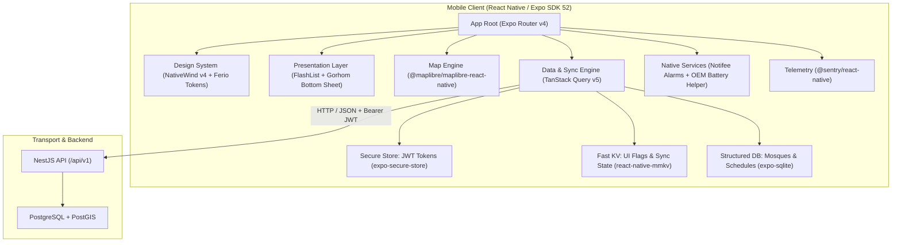

# Feature Specification: Cross-Platform Mobile Client (React Native & Expo SDK 52+)

## 1. Overview
This specification details the enterprise-grade engineering implementation for the BD Masjid cross-platform mobile client for Android and iOS using **React Native with Expo SDK 52+**. 

The mobile application replicates 100% of the web frontend's visual language (*Ferio Minimalist System* per `.agents/skills/ferio-frontend-design/SKILL.md`), utilizes OpenStreetMap raster tiles for geospatial exploration, shares the existing TypeScript domain models, and implements an enterprise-grade mobile resilience stack:
- **TanStack Query v5** for request deduping, background synchronization, and automatic retries.
- **Tiered storage architecture**: Hardware-backed KeyStore (`expo-secure-store`), synchronous memory-mapped flags (`react-native-mmkv`), and structured indexed offline caching (`expo-sqlite`).
- **Low-end hardware optimization**: Shopify `FlashList` for 60 FPS scrolling on 2GB RAM budget Android hardware.
- **Battery-safe exact prayer alarms**: `@notifee/react-native` with OEM battery management mitigation.
- **Production telemetry**: Full-stack crash reporting and breadcrumbs via `@sentry/react-native`.

---

## 2. Business & Architectural Invariants

1. **Zero Server Invariant Migration**: The mobile application is strictly an untrusted presentation layer. All geospatial boundary filtering, duplicate detection (ADR-005), role verification (ADR-003, ADR-019), and moderation rules remain solely enforced by the NestJS/PostGIS backend.
2. **Design Language Conformance (Ferio Standard)**:
   - Base Palette: `#111114` (primary text/buttons), `#6e6e73` (muted text/icons), `#e8e8ea` (borders/dividers), `#fafafa` (canvas), `#ffffff` (cards).
   - Accents: Emerald (`#059669`) for active/verified states; Amber/Rose for stale timetables.
   - Geometry: 10px–16px card radii (`rounded-2xl`), hairline 1px borders, rounded-full pill buttons.
   - Prohibitions: No glossy gradients, glassmorphism, heavy drop shadows, or non-system font families.
3. **OpenStreetMap Independence**: Base maps must be served from OpenStreetMap tile servers with local caching. Google Maps SDK billing and proprietary API keys are strictly excluded.
4. **List Performance on Low-End Devices**: Every scrollable feed of mosques, staff members, or announcements must use `@shopify/flash-list` with estimated item sizes to prevent memory leaks and frame drops on 2GB RAM Android hardware.
5. **Offline-First Resilience**: When network connectivity is lost, the client must seamlessly present cached followed mosques and prayer schedules from local SQLite storage, accompanied by an explicit offline status indicator.
6. **Battery-Safe Exact Alarms**: Local Jammat and Azan reminders must be scheduled via system AlarmManager (`SCHEDULE_EXACT_ALARM` / `USE_EXACT_ALARM`) without running persistent background service loops or continuous polling.
7. **Secure Token Storage**: Authentication tokens must never be written to plaintext storage; hardware-backed `expo-secure-store` is mandatory.

---

## 3. Native Architecture & Tech Stack

### Component Breakdown
| Enterprise Concern | Technology Choice | Production Rationale |
| :--- | :--- | :--- |
| **Framework Runtime** | Expo SDK 52+ / React Native 0.76+ | Bridgeless Mode, TurboModules, Hermes AOT compilation by default. |
| **Build & Compilation** | Expo Prebuild (`expo-dev-client`) | Enables native MapLibre and Notifee compilation via Config Plugins. |
| **Network & Sync Engine** | **TanStack Query v5** | Query deduping, background sync on AppState focus, exponential retries. |
| **Secure Token Storage** | **`expo-secure-store`** | Hardware-backed KeyStore/Keychain encryption for auth tokens. |
| **High-Speed Cache** | **`react-native-mmkv`** | 30x faster synchronous key-value store for preferences and sync timestamps. |
| **Structured Offline Store** | **`expo-sqlite`** | Caches full mosque records and schedules with indexing; zero JS thread stalls. |
| **Styling & Tokens** | **NativeWind v4** (TailwindCSS) | 1:1 class name parity with existing Next.js Tailwind markup. |
| **List Virtualization** | **`@shopify/flash-list`** | Aggressive cell recycling; sustains 60 FPS on 2GB RAM budget hardware. |
| **Interactive Map** | **`@maplibre/maplibre-react-native`** | Hardware-accelerated OpenGL/Metal rendering of OpenStreetMap tiles. |
| **Modals / Sheets** | **`@gorhom/bottom-sheet`** | Reanimated 3 fluid bottom-sheet modals with native gesture handling. |
| **Prayer Alarms** | **`@notifee/react-native`** | Reliable exact alarms for Android 12–15 with OEM battery bypass guidance. |
| **Observability** | **`@sentry/react-native`** | Real-time crash telemetry, sanitized breadcrumbs, and performance tracking. |

---

## 4. API Endpoints Consumed (Existing NestJS Backend)

The mobile client interacts exclusively with existing production endpoints:
- `GET /api/v1/mosques/nearby?lat={lat}&lng={lng}&radiusMeters={radius}` — Spherical radial search.
- `GET /api/v1/mosques/search?q={query}&city={city}` — Text search and facility filters.
- `GET /api/v1/mosques/:id` — Full mosque profile with schedule and facilities.
- `POST /api/v1/mosques` — Contributor mosque creation with duplicate check.
- `GET /api/v1/mosques/user/followed` — User's followed mosques.
- `POST /api/v1/mosques/:id/follow` — Follow/unfollow toggle.
- `POST /api/v1/mosques/:id/attendance` — Regular/occasional attendance toggle.
- `GET /api/v1/announcements/mosque/:mosqueId` — Active official announcements.
- `GET /api/v1/donations/mosque/:mosqueId` — Verified donation channels with creator provenance.

---

## 5. Implementation Slices & Proof Matrix

### TK-MOB-01: Expo Prebuild Scaffolding, NativeWind v4 & Hardware Keystore Token Storage
- **Status**: `[ ] Pending` | **Priority**: Critical
- **Description**: Initialize the Expo SDK 52+ application with TypeScript, configure custom development client (`expo-dev-client`) and prebuild config plugins, set up NativeWind v4 with exact Ferio tokens, and configure `expo-secure-store` for hardware-encrypted JWT storage.
- **Acceptance Criteria**:
  - [ ] App boots cleanly on physical Android and iOS devices using `expo-dev-client`.
  - [ ] Hermes engine and Bridgeless New Architecture active.
  - [ ] `tailwind.config.js` configures palette: `#111114`, `#6e6e73`, `#e8e8ea`, `#fafafa`, and `#ffffff`.
  - [ ] `expo-secure-store` provides encrypted access token getter/setter with zero plaintext exposure.
- **Target Files**:
  - `mobile/package.json`
  - `mobile/app.json` (config plugins)
  - `mobile/tailwind.config.js`
  - `mobile/src/lib/secureStorage.ts`

### TK-MOB-02: TanStack Query v5 Network Layer, FlashList Virtualization & Live Countdown
- **Status**: `[ ] Pending` | **Priority**: High
- **Description**: Implement TanStack Query v5 client with exponential backoff and offline persister, build `PrayerCountdownBanner` with 1-second interval ticker, and implement Shopify `FlashList` for `MosqueCard`.
- **Acceptance Criteria**:
  - [ ] TanStack Query retries failed queries up to 3 times with exponential backoff on flaky cellular networks.
  - [ ] `PrayerCountdownBanner` renders real-time 1-second countdown to next prayer using `lib/time.ts`.
  - [ ] Horizontal filter chips allow filtering by *Women's Area*, *AC*, *Wheelchair*, *Parking*, and *Following*.
  - [ ] `FlashList` sustains 60 FPS scrolling on memory-constrained 2GB RAM test profiles.
- **Target Files**:
  - `mobile/src/lib/queryClient.ts`
  - `mobile/src/components/PrayerCountdownBanner.tsx`
  - `mobile/src/components/MosqueCard.tsx`
  - `mobile/src/screens/HomeScreen.tsx`

### TK-MOB-03: OpenStreetMap Native MapLibre Engine, Custom Pin Hierarchy & Pin Drop Mode
- **Status**: `[ ] Pending` | **Priority**: High
- **Description**: Configure `@maplibre/maplibre-react-native` with OpenStreetMap raster tiles, local tile caching, custom circular pins, and contributor pin-drop mode.
- **Acceptance Criteria**:
  - [ ] OpenStreetMap raster tiles render crisply without Google Maps SDK dependencies.
  - [ ] Custom circular pins reflect followed (`#059669`) and standard (`#111114`) mosque states.
  - [ ] Pin drop mode allows dropping a marker with latitude/longitude output for new mosque creation.
  - [ ] Floating bottom toggle pill `[List (N) | Map]` toggles viewports smoothly.
- **Target Files**:
  - `mobile/src/components/MosqueMap.tsx`
  - `mobile/src/components/ViewTogglePill.tsx`

### TK-MOB-04: Gesture-Driven Mosque Detail Bottom Sheet & Governance Modals
- **Status**: `[ ] Pending` | **Priority**: High
- **Description**: Implement `@gorhom/bottom-sheet` featuring facilities, verified staff roster (ADR-024), official announcements (ADR-011), and verified donation channels (ADR-028).
- **Acceptance Criteria**:
  - [ ] Bottom sheet expands to 50% and 90% snap points smoothly via gesture drags.
  - [ ] Displays verified staff members with photo and official role badges (ADR-024).
  - [ ] Displays verified donation accounts with 1-tap copy and green tick leadership indicators (ADR-028).
  - [ ] Community suggestion and problem reporting actions open accessible native sub-modals.
- **Target Files**:
  - `mobile/src/components/MosqueDetailSheet.tsx`
  - `mobile/src/components/DonationChannelsList.tsx`
  - `mobile/src/components/ReportModal.tsx`

### TK-MOB-05: Tiered Offline Persistence (MMKV + SQLite) & Resilient Attendance Sync
- **Status**: `[ ] Pending` | **Priority**: Medium
- **Description**: Implement high-speed synchronous storage with `react-native-mmkv` and structured SQL caching with `expo-sqlite`, providing seamless offline viewing and idempotent mutation replay upon reconnection.
- **Acceptance Criteria**:
  - [ ] Followed mosques and full schedules persist across app restarts in SQLite.
  - [ ] Offline banner displays automatically when network is unavailable, serving cached timetables.
  - [ ] Attendance toggle mutations queue offline and sync idempotently on reconnect.
- **Target Files**:
  - `mobile/src/lib/database.ts` (SQLite schema & queries)
  - `mobile/src/lib/kvStorage.ts` (MMKV instance)
  - `mobile/src/hooks/useFollowedMosques.ts`

### TK-MOB-06: Background Exact Jammat Alarms, OEM Battery Mitigation & Sentry Telemetry
- **Status**: `[ ] Pending` | **Priority**: High
- **Description**: Integrate `@notifee/react-native` for exact Jammat reminders, implement OEM battery optimization bypass guidance, and integrate `@sentry/react-native` for sanitized crash reporting.
- **Acceptance Criteria**:
  - [ ] Requests required notification and exact alarm permissions on Android 12–15 and iOS.
  - [ ] Detects OEM battery savers (Xiaomi, Oppo, Samsung) and presents educational whitelist modal.
  - [ ] Alarms trigger precisely 10 minutes prior to Jamaat start with custom sound/vibration.
  - [ ] Sentry captures fatal crashes and non-fatal exceptions with sanitized breadcrumbs.
- **Target Files**:
  - `mobile/src/services/alarmService.ts`
  - `mobile/src/services/batteryOptimization.ts`
  - `mobile/src/lib/sentry.ts`
