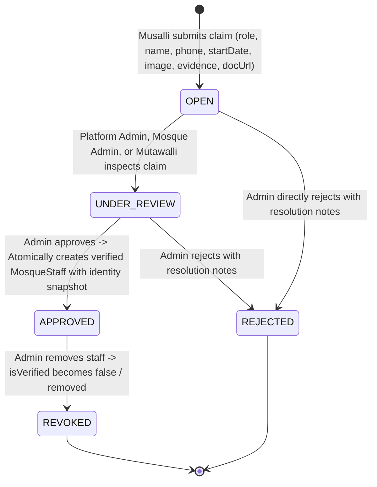

# Feature Specification: Mosque Super-Admin Governance, Mutawalli Role Separation, Custom Roles & Identity Verification Claims (F-026)

## 1. Overview & Problem Statement

In initial staff delegation work (`F-020`), administrative power at the mosque level was conflated under a single `MOSQUE_ADMIN` role labeled "Mosque Administrator (Mutawalli)". In real Bangladeshi mosque ecosystems:
1. **Mutawalli** (traditional trust custodian under Waqf arrangements) and **Mosque Administrator** (contemporary administrative manager) are distinct, prestigious roles. Both represent executive authorities of the mosque institution and must possess **super permissions** for their mosque.
2. Mosques frequently employ vital personnel whose roles are not captured in a rigid enum (e.g. *Assistant Imam*, *Treasurer / Cashier*, *Security Supervisor*, *IT / Media Coordinator*). Lack of custom role support disenfranchises authentic mosque staff.
3. The role claim submission process lacked fundamental applicant identity verification fields: **Full Name**, **Contact Phone Number**, **Service Starting Date**, and a **Personal Portrait / Image Upload**. Reviewers and moderators were forced to evaluate claims without photographic or contact provenance.

**F-026** resolves these limitations across database schema, backend RBAC logic, and frontend interactive modals:
- Explicitly separates `MOSQUE_ADMIN` and `MUTAWALLI` in `MosqueStaffRole`.
- Grants **super permissions** to **both** `MOSQUE_ADMIN` and `MUTAWALLI` for their assigned mosque.
- Adds `CUSTOM` role support with a mandatory `customRoleTitle` across claims and staff rosters.
- Enriches the claim submission modal and schema with `name`, `phoneNumber`, `startDate`, and direct `imageUrl` photo upload.
- Seamlessly transfers all identity and tenure attributes into verified `MosqueStaff` records upon claim approval.

---

## 2. Business Invariants & State Machine

### 2.1 State Transitions for Role Claims


### 2.2 Core Invariants
1. **Dual Super-Permission Governance**:
   - Both verified `MOSQUE_ADMIN` and `MUTAWALLI` hold equivalent mosque-scoped super permissions.
   - Either can review, approve, or reject claims for standard local staff (`IMAM`, `MUAZZIN`, `KHATIB`, `KHADEM`, `COMMITTEE_MEMBER`, `CUSTOM`).
   - Either can add or remove local staff, publish `EMERGENCY_ALERT` announcements, edit facilities, and submit/verify donation accounts.
2. **Super-Role Anti-Takeover Rule**:
   - Claims for `MOSQUE_ADMIN` or `MUTAWALLI` can **ONLY** be reviewed and approved by global platform `admin` or `moderator` accounts.
   - A local `MOSQUE_ADMIN` or `MUTAWALLI` cannot approve or revoke another `MOSQUE_ADMIN` or `MUTAWALLI`.
3. **Custom Role Integrity**:
   - If `role === 'CUSTOM'`, `customRoleTitle` is mandatory (2–60 characters).
   - If `role !== 'CUSTOM'`, `customRoleTitle` must be null or ignored.
4. **Identity & Tenure Provenance**:
   - Every claim must record `name` (>= 2 chars) and `phoneNumber` (>= 8 chars).
   - `startDate` is captured when provided and preserved upon claim approval.
   - `imageUrl` captures the applicant's verified portrait photo and transfers to the verified staff profile upon approval.
5. **Single-Pending Invariant**:
   - A user cannot have multiple simultaneous `OPEN` or `UNDER_REVIEW` claims for the same mosque.
6. **Atomic Provisioning**:
   - Claim approval atomically transitions `MosqueRoleClaim`, provisions `MosqueStaff` with complete identity fields (`name`, `contactNumber`, `role`, `customRoleTitle`, `startDate`, `imageUrl`), and logs an `AuditLog` entry in a single PostgreSQL `$transaction`.

---

## 3. Data Model Reference

### 3.1 Role Enums
```prisma
enum MosqueStaffRole {
  MOSQUE_ADMIN
  MUTAWALLI
  IMAM
  MUAZZIN
  KHATIB
  KHADEM
  COMMITTEE_PRESIDENT
  COMMITTEE_SECRETARY
  COMMITTEE_MEMBER
  CUSTOM
}

enum RoleClaimStatus {
  OPEN
  UNDER_REVIEW
  APPROVED
  REJECTED
}
```

### 3.2 MosqueStaff Model
```prisma
model MosqueStaff {
  id              String          @id @default(cuid())
  mosqueId        String
  mosque          Mosque          @relation(fields: [mosqueId], references: [id], onDelete: Cascade)

  userId          String?
  user            User?           @relation(fields: [userId], references: [id], onDelete: SetNull)

  role            MosqueStaffRole
  customRoleTitle String?
  name            String
  contactNumber   String?
  startDate       DateTime?
  imageUrl        String?
  isVerified      Boolean         @default(false)
  verifiedAt      DateTime?
  verifiedById    String?

  createdAt       DateTime        @default(now())
  updatedAt       DateTime        @updatedAt

  @@index([mosqueId, role])
  @@index([mosqueId, role, isVerified])
  @@index([userId, isVerified])
  @@index([userId])
}
```

### 3.3 MosqueRoleClaim Model
```prisma
model MosqueRoleClaim {
  id              String          @id @default(cuid())
  mosqueId        String
  mosque          Mosque          @relation(fields: [mosqueId], references: [id], onDelete: Cascade)

  userId          String
  user            User            @relation(fields: [userId], references: [id], onDelete: Cascade)

  role            MosqueStaffRole
  customRoleTitle String?
  name            String
  phoneNumber     String
  startDate       DateTime?
  imageUrl        String?
  evidence        String
  documentUrl     String?
  status          RoleClaimStatus @default(OPEN)

  reviewedById    String?
  reviewedAt      DateTime?
  resolutionNotes String?

  createdAt       DateTime        @default(now())
  updatedAt       DateTime        @updatedAt

  @@index([mosqueId, status])
  @@index([userId, status])
  @@index([userId])
}
```

---

## 4. REST API Contracts

### 4.1 Claim Submission
- **`POST /api/v1/mosques/:id/role-claims`** (or `/api/v1/community/:id/role-claims`)
  - **Auth**: Bearer JWT (`UserRole.user` or higher)
  - **Body**:
    ```json
    {
      "role": "CUSTOM",
      "customRoleTitle": "Assistant Imam & Quran Teacher",
      "name": "Mawlana Hafiz Ahmed",
      "phoneNumber": "01712345678",
      "startDate": "2023-01-15T00:00:00.000Z",
      "imageUrl": "https://example.com/uploads/hafiz.jpg",
      "evidence": "Appointed by Mosque Committee resolution in January 2023. Reference: Mutawalli Haji Rahman (01811111111).",
      "documentUrl": "https://example.com/docs/appointment-deed.pdf"
    }
    ```
  - **Success Response (201 Created)**: Returns created `MosqueRoleClaim` object.
  - **Validation Envelopes**:
    - `400 Bad Request`: Missing name, phone, or customRoleTitle when role is CUSTOM.
    - `409 Conflict`: User already has a pending claim for this mosque.

### 4.2 Claim Review / Approval
- **`PATCH /api/v1/community/role-claims/:claimId/review`**
  - **Auth**: Bearer JWT.
    - For `MOSQUE_ADMIN` or `MUTAWALLI`: Platform `admin` or `moderator` only.
    - For other roles: Verified local `MOSQUE_ADMIN`, `MUTAWALLI`, or Platform `admin`/`moderator`.
  - **Body**:
    ```json
    {
      "status": "APPROVED",
      "resolutionNotes": "Verified with managing committee president."
    }
    ```
  - **Behavior**: Atomically creates verified `MosqueStaff` with transferred identity (`name`, `contactNumber`, `role`, `customRoleTitle`, `startDate`, `imageUrl`).

### 4.3 Claim Image Upload (Optional Direct Endpoint)
- **`POST /api/v1/community/upload-image`**
  - **Auth**: Bearer JWT
  - **Content-Type**: `multipart/form-data`
  - **File Field**: `image` (max 5MB, jpeg/png/webp)
  - **Response (201 Created)**: `{ "url": "/uploads/claims/..." }`

---

## 5. Extracted Implementation Checklist

- [x] Add `MUTAWALLI` and `CUSTOM` to `MosqueStaffRole` in Prisma schema fragment.
- [x] Add `customRoleTitle`, `startDate`, `imageUrl` to `MosqueStaff` and `MosqueRoleClaim`.
- [x] Add `name`, `phoneNumber` to `MosqueRoleClaim`.
- [x] Run Prisma schema sync and generate migration.
- [x] Update DTOs: `CreateRoleClaimDto`, `AddStaffDto`.
- [x] Update `CommunityService`: dual super-permission checks, identity transfer on approval.
- [x] Update cross-module RBAC in `AnnouncementsService`, `FacilitiesService`, `DonationsService` to include `MUTAWALLI`.
- [x] Enhance `RoleClaimModal.tsx` with all required fields, custom role input, and photo upload preview.
- [x] Update `MosqueStaffManager.tsx` and `MosqueDetailModal.tsx` to display dual super roles, custom titles, tenure dates, and avatars.
- [x] Verify test suite and frontend compilation.

---

## 6. Implementation Slices & Proof of Completion

### TK-GOV-01: Prisma Schema & Cross-Feature Dual Super-Permission RBAC
- **Status**: `[x] Completed` | **Priority**: Critical
- **Description**: Add `MUTAWALLI` and `CUSTOM` roles to Prisma schema, add identity fields, sync Prisma client, and extend super-permission checks across Community, Announcements, Facilities, and Donations modules.
- **Acceptance Criteria**:
  - [x] Prisma schema fragment contains `MUTAWALLI` and `CUSTOM` with new fields.
  - [x] Migration script generated and applied.
  - [x] Dual super-roles (`MOSQUE_ADMIN` & `MUTAWALLI`) recognized in claim review, staff management, announcements, and facilities.
  - [x] Automated tests pass with 100% coverage of dual super permissions.
- **Implementation Files**:
  - `backend-nest-prisma/prisma/schema/community.module/community.prisma`
  - `backend-nest-prisma/prisma/schema.prisma`
  - `backend-nest-prisma/prisma/migrations/20261001140000_mutawalli_and_custom_role_claims/migration.sql`
  - `backend-nest-prisma/src/features/community/community.service.ts`
  - `backend-nest-prisma/src/features/community/community.controller.ts`
  - `backend-nest-prisma/src/features/community/dto/create-claim.dto.ts`
  - `backend-nest-prisma/src/features/community/dto/add-staff.dto.ts`
  - `backend-nest-prisma/src/features/announcements/announcements.service.ts`
  - `backend-nest-prisma/src/features/facilities/facilities.service.ts`
  - `backend-nest-prisma/src/features/donations/donations.service.ts`
  - `backend-nest-prisma/src/features/community/test/community.service.spec.ts`

### TK-GOV-02: Enhanced Role Claim Modal with Name, Phone, Start Date, Custom Role & Image Upload
- **Status**: `[x] Completed` | **Priority**: High
- **Description**: Upgrade the frontend `RoleClaimModal.tsx` to support the new fields, interactive photo upload with avatar preview, custom role selector with dynamic title input, and clear guidance.
- **Acceptance Criteria**:
  - [x] Modal includes name, phone number, starting date, and personal image upload.
  - [x] Official role dropdown contains Mosque Administrator, Mutawalli, standard roles, and Custom Role.
  - [x] Selecting Custom Role displays required Custom Role Title input.
  - [x] Image upload allows selecting an image file, previews avatar immediately, and sends image data.
  - [x] Form validates phone number format, name length, and custom title requirements.
- **Implementation Files**:
  - `frontend/src/components/RoleClaimModal.tsx`
  - `frontend/src/lib/api.ts`
  - `frontend/src/types/mosque.ts`

### TK-GOV-03: Roster & Roster Manager Governance UI Updates
- **Status**: `[x] Completed` | **Priority**: High
- **Description**: Update `MosqueStaffManager.tsx` and `MosqueDetailModal.tsx` to recognize Mutawalli as super-admin, display custom role titles, tenure dates, and applicant/staff portrait photos.
- **Acceptance Criteria**:
  - [x] Both `MOSQUE_ADMIN` and `MUTAWALLI` access the management console and claim review queue.
  - [x] Pending claims display applicant name, contact phone, starting date, and uploaded avatar.
  - [x] Staff directory displays verified badges, custom role designations, and staff photos.
  - [x] All unit and type tests pass cleanly.
- **Implementation Files**:
  - `frontend/src/components/MosqueStaffManager.tsx`
  - `frontend/src/components/MosqueDetailModal.tsx`
