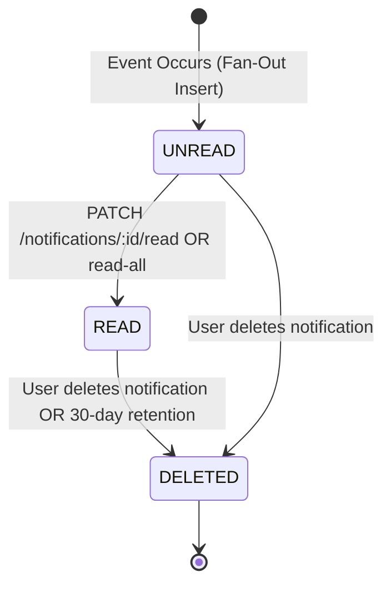

# F-031: Mosque Follow Subscriptions & Real-Time In-App Notifications

## 1. Overview & Problem Statement
In Bangladesh, congregants rely on their local and community mosques for daily prayer times, Jumu'ah khutbah announcements, Janaza funeral alerts, and verified donation drives. Currently, users must manually search or browse to inspect updates. 

Feature `F-031` provides:
1. **Mosque Follow Subscriptions**: Authenticated users can "Follow" one or more mosques to pin them at the top of their discovery feeds and subscribe to operational updates.
2. **Durable In-App Notifications**: Stored in PostgreSQL with per-user unread tracking, instant unread badges, and a historical notification drawer.
3. **Real-Time WebSocket Gateway**: A production-grade NestJS WebSocket Gateway (Socket.io) delivering sub-second toast alerts and unread counter increments directly to active browser tabs whenever an announcement, schedule shift, or verified donation account is published.

---

## 2. Business Invariants & State Machine

### 2.1 Subscription Invariants
1. **Authentication Requirement**: Only registered users with a verified JWT session can follow a mosque. Unauthenticated guest clicks prompt the `AuthModal`.
2. **Idempotent Following**: Following an already-followed mosque is a no-op returning `200 OK`. Unfollowing a non-followed mosque returns `200 OK`.
3. **Cascading Deletion**: If a mosque is deleted, all `MosqueFollower` and associated `UserNotification` rows cascade cleanly.

### 2.2 Notification Generation Triggers
A `UserNotification` is generated and pushed to all followers when:
- **`ANNOUNCEMENT`**: Verified staff publishes an official mosque announcement (`F-022`), flagged with category (`EMERGENCY_ALERT`, `GENERAL`, `JUMUAH_KHUTBAH`, `JANAZA_NOTICE`).
- **`SCHEDULE_CHANGE`**: Verified staff or platform admin adjusts the Waqt or daily Jamaat prayer schedule (`F-007`).
- **`DONATION_UPDATE`**: Platform admin verifies and activates an official bKash, Nagad, or Bank donation destination (`F-030`).
- **`PRAYER_REMINDER`**: Automated 15-minute countdown reminder before upcoming Jamaat.

### 2.3 Notification State Transitions


---

## 3. Data Model & Prisma Schema Changes

### 3.1 `MosqueFollower` Model
```prisma
model MosqueFollower {
  id        String   @id @default(cuid())
  mosqueId  String
  mosque    Mosque   @relation(fields: [mosqueId], references: [id], onDelete: Cascade)
  userId    String
  user      User     @relation(fields: [userId], references: [id], onDelete: Cascade)
  createdAt DateTime @default(now())

  @@unique([userId, mosqueId])
  @@index([userId, createdAt])
  @@index([mosqueId, createdAt])
}
```

### 3.2 `UserNotification` Model
```prisma
enum NotificationType {
  ANNOUNCEMENT
  SCHEDULE_CHANGE
  DONATION_UPDATE
  PRAYER_REMINDER
}

model UserNotification {
  id        String           @id @default(cuid())
  userId    String
  user      User             @relation(fields: [userId], references: [id], onDelete: Cascade)
  mosqueId  String
  mosque    Mosque           @relation(fields: [mosqueId], references: [id], onDelete: Cascade)
  type      NotificationType
  title     String
  body      String
  entityId  String?          // e.g. announcementId, scheduleId, donationId
  isRead    Boolean          @default(false)
  readAt    DateTime?
  createdAt DateTime         @default(now())

  @@index([userId, isRead, createdAt])
  @@index([userId, createdAt])
  @@index([mosqueId, createdAt])
}
```

---

## 4. REST API Contracts & WebSocket Events

### 4.1 REST Endpoints

| Method | Endpoint | Auth | Description | Success Response |
| :--- | :--- | :---: | :--- | :--- |
| `POST` | `/api/v1/mosques/:id/follow` | `User` | Follow a mosque | `200 { success: true, isFollowing: true, followersCount: number }` |
| `DELETE` | `/api/v1/mosques/:id/follow` | `User` | Unfollow a mosque | `200 { success: true, isFollowing: false, followersCount: number }` |
| `GET` | `/api/v1/mosques/:id/follow-status` | Optional | Check if current user follows | `200 { isFollowing: boolean, followersCount: number }` |
| `GET` | `/api/v1/mosques/followed` | `User` | Get all mosques followed by user | `200 { items: Mosque[] }` |
| `GET` | `/api/v1/notifications` | `User` | Paginated in-app notification inbox | `200 { items: UserNotification[], unreadCount: number }` |
| `GET` | `/api/v1/notifications/unread-count` | `User` | Fetch active unread badge count | `200 { unreadCount: number }` |
| `PATCH` | `/api/v1/notifications/:id/read` | `User` | Mark single notification as read | `200 { success: true, notification: UserNotification }` |
| `PATCH` | `/api/v1/notifications/read-all` | `User` | Mark all user notifications as read | `200 { success: true, updatedCount: number }` |

### 4.2 WebSocket Gateway Contract
- **Namespace**: `/notifications`
- **Transport**: `['websocket', 'polling']`
- **Handshake Auth**: `auth: { token: BearerToken }`
- **Client Auto-Join Rooms**: `user:<userId>` and `mosque:<mosqueId>` for all followed mosques.
- **Server Events Emitted**:
  - `notification:new`: Payload: `{ id, mosqueId, mosqueName, type, title, body, entityId, createdAt }`
  - `notification:unread_count`: Payload: `{ unreadCount: number }`

---

## 5. Security & Audit Logging
1. **Server-Side Actor Derivation**: The user ID is strictly extracted from verified JWT context (`req.user.id`). Client cannot manipulate `userId` parameters.
2. **Cross-Tenant Isolation**: Users can only query, read, or delete notifications where `userId === req.user.id`. Any attempt to mark another user's notification as read returns `404 Not Found`.
3. **Audit Logging**: High-impact events (`EMERGENCY_ALERT` broadcasts, schedule changes, verified donation updates) log fan-out counts to `AuditLog`.

---

## 6. Actionable Implementation Checklist

### Slice 1: Database Schema & Migration (Prisma)
- [x] Add `MosqueFollower` model to `backend-nest-prisma/prisma/schema/` with composite unique constraint `[userId, mosqueId]`.
- [x] Add `NotificationType` enum and `UserNotification` model with composite index `[userId, isRead, createdAt]`.
- [x] Run `pnpm run prisma:sync` to compile schema and update generated client.

### Slice 2: Backend Notifications & Follow Service
- [x] Create `NotificationsModule` in `backend-nest-prisma/src/features/notifications/`.
- [x] Implement `NotificationsGateway` with JWT handshake authentication and room management.
- [x] Implement `NotificationsService` with fan-out generation, unread counters, and pagination.
- [x] Implement `MosqueFollowService` and controller for `/mosques/:id/follow` and `/mosques/followed`.
- [x] Wire hooks in `AnnouncementsService`, `PrayerSchedulesService`, and `DonationsService` to emit notifications on create/update.
- [x] Write unit tests for `NotificationsService`, `MosqueFollowService`, and `NotificationsGateway`.

### Slice 3: Frontend Navbar Notification Center & Follow Interaction
- [x] Install `socket.io-client` in `frontend/`.
- [x] Add typed API client functions for follow status, notification queries, and read operations in `frontend/src/lib/api.ts`.
- [x] Implement `useNotifications` React hook managing WebSocket connection, unread badge, and real-time toast alerts.
- [x] Add Notification Bell with unread counter pill and dropdown popover to `Navbar.tsx`.
- [x] Add `[+ Follow]` / `[✓ Following]` button to `MosqueCard.tsx` and `/mosques/[id]/page.tsx`.
- [x] Run full test suite (`backend-nest-prisma && npm test`) and frontend production build (`frontend && npm run build`).
