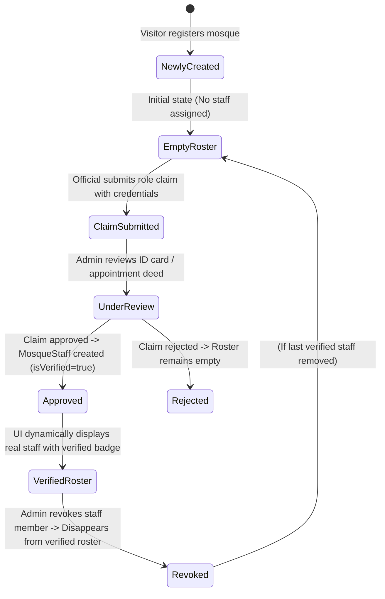

# Feature Specification: Mosque Verified Personnel Roster & Empty State Governance (F-024)

## 1. Overview & Problem Statement

When a visitor or community member creates a new mosque on the platform, the mosque is initially registered in an unverified state (`verificationStatus: UNVERIFIED`) with no assigned personnel. However, the mosque details view (`MosqueDetailModal`) previously displayed static, hardcoded placeholder entries for "Pesh Imam (Verified)" and "Muazzin (Verified)".

This created a severe integrity flaw:
1. **False Authority & Misinformation**: Worshipers visiting a newly created mosque profile were falsely informed that an appointed Pesh Imam and Muazzin had been vetted and verified by the platform, when in reality no claim or appointment existed.
2. **Missing Empty State & Onboarding Call-to-Action**: Local Imams, Muazzins, and Committee Members visiting their mosque's newly created profile were not guided to claim their legitimate roles because the UI already displayed fictitious verified roles.

**F-024** eliminates all hardcoded staff placeholders across the platform, establishing a strict **Zero False Verification Invariant**. Mosque details views must dynamically render exclusively genuine, verified `MosqueStaff` records returned from the backend registry, with a clean, actionable empty state when no personnel are appointed yet.

---

## 2. Business Invariants & State Machine

### 2.1 The Zero False Verification Invariant
1. **No Phantom Roles**: Under no circumstances may the UI display a "Verified" badge or persona (Pesh Imam, Muazzin, Khatib, Committee President) unless an underlying record exists in `MosqueStaff` with `isVerified: true` tied to that specific `mosqueId`.
2. **Newly Created Mosque Default State**:
   - Every newly created mosque starts with an empty staff roster (`staffMembers: []`).
   - The UI MUST render an explicit unassigned empty state: `"No appointed Imams or committee members verified yet."`
3. **Role Claim Affordance**:
   - The empty state must invite legitimate mosque officials (Imams, Muazzins, Mutawallis) to submit a formal verification request via `Claim Official Role` (`onOpenRoleClaim`).
4. **Dynamic Roster Population**:
   - Once a claim is approved by a Platform Administrator or local Mosque Admin, the verified staff member must appear dynamically with their actual name, standardized role title, contact details (if public), and verified badge.

### 2.2 Roster Lifecycle State Diagram


---

## 3. Data & Component Contracts

### 3.1 Backend Contract (`GET /api/v1/mosques/:id`)
The mosque profile response includes only verified staff members:
```json
{
  "id": "mosque-uuid",
  "name": "Baitul Takwa Jame Mashjid",
  "verificationStatus": "UNVERIFIED",
  "staffMembers": []
}
```

### 3.2 Staff Directory Endpoint (`GET /api/v1/mosques/:id/staff`)
```json
{
  "success": true,
  "data": [
    {
      "id": "staff-uuid",
      "mosqueId": "mosque-uuid",
      "role": "IMAM",
      "name": "Maulana Abdur Rahman",
      "contactNumber": "+8801711000000",
      "isVerified": true,
      "verifiedAt": "2026-10-01T12:00:00.000Z"
    }
  ]
}
```

### 3.3 Role Label & Hierarchy Mapping
| `MosqueStaffRole` | Display Title | Subtitle / Description |
| :--- | :--- | :--- |
| `MOSQUE_ADMIN` | Mosque Administrator | Mutawalli / Committee Head |
| `IMAM` | Pesh Imam | Appointed Islamic Scholar |
| `MUAZZIN` | Muazzin | Regular Caller to Prayer |
| `KHATIB` | Chief Khatib | Friday Khutbah Speaker |
| `KHADEM` | Khadem | Mosque Caretaker |
| `COMMITTEE_PRESIDENT` | Committee President | Executive Leadership |
| `COMMITTEE_SECRETARY` | General Secretary | Administrative Leadership |
| `COMMITTEE_MEMBER` | Committee Member | Management Committee |

---

## 4. Implementation Checklist

- [x] **Remove Static Placeholders**: Purge hardcoded Pesh Imam and Muazzin JSX blocks from `frontend/src/components/MosqueDetailModal.tsx`.
- [x] **Dynamic Staff Loading**: Integrate `fetchMosqueStaff(mosque.id)` and `mosque.staffMembers` state in `MosqueDetailModal.tsx`.
- [x] **Ferio Empty State**: Design and implement the Ferio-compliant empty state when `staffList.length === 0` with inline `Claim official role` trigger.
- [x] **Dynamic Staff Cards**: Render verified staff members dynamically showing their real name, role badge, contact number, and verified badge.
- [x] **Standalone Page Parity**: Ensure `frontend/src/app/mosques/[id]/page.tsx` continues to properly use `MosqueStaffManager` with zero dummy data.
- [x] **Integration Verification**: Verify newly created mosque exhibits empty state without errors, and approved staff appear correctly.

---

## 5. Work Slices & Proof Matrix

### TK-ROSTER-01: Mosque Details Dynamic Staff Roster & Empty State UI
- **Component**: `frontend/src/components/MosqueDetailModal.tsx`
- **Status**: completed
- **Priority**: High
- **Acceptance Criteria**:
  - [x] Newly created mosque shows "No appointed Imams or committee members verified yet" instead of fake verified staff.
  - [x] Clicking "Claim official role" opens the role claim modal with the target mosque pre-selected.
  - [x] Verified staff members are rendered dynamically with name and role tag.
  - [x] No regression on map discovery, attendance toggling, or prayer times display.

### Proof of Implementation
- **Source Code**: [`frontend/src/components/MosqueDetailModal.tsx`](file:///home/chillpc/MohammadSheakh/projects/26/bd-moshjid/bd-moshjid-project/bd-moshjid-project/frontend/src/components/MosqueDetailModal.tsx)
- **Standalone Page Component**: [`frontend/src/components/MosqueStaffManager.tsx`](file:///home/chillpc/MohammadSheakh/projects/26/bd-moshjid/bd-moshjid-project/bd-moshjid-project/frontend/src/components/MosqueStaffManager.tsx)
- **API Client**: [`frontend/src/lib/api.ts`](file:///home/chillpc/MohammadSheakh/projects/26/bd-moshjid/bd-moshjid-project/bd-moshjid-project/frontend/src/lib/api.ts) (`fetchMosqueStaff`)
- **Backend Service**: [`backend-nest-prisma/src/features/mosques/mosques.service.ts`](file:///home/chillpc/MohammadSheakh/projects/26/bd-moshjid/bd-moshjid-project/bd-moshjid-project/backend-nest-prisma/src/features/mosques/mosques.service.ts) (`findById` verified `staffMembers`)
