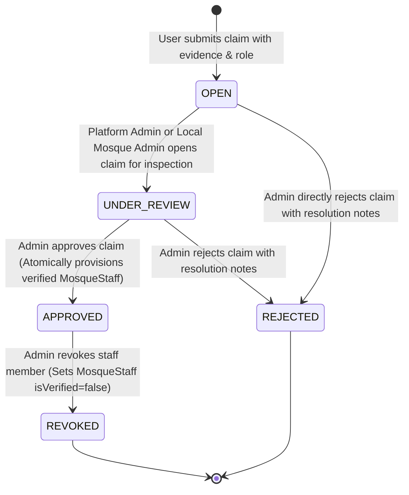
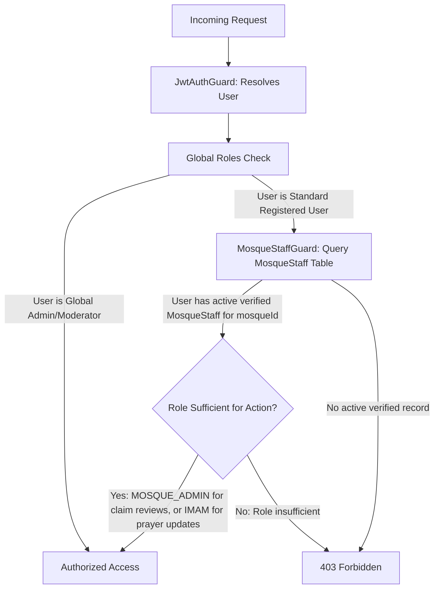

# Feature Specification: Mosque Staff Delegation & Role Claim Governance (F-020)

## 1. Overview & Problem Statement

In Release 1, platform administration was centralized under global `admin` and `moderator` accounts. As the platform scales into Release 2, centralized administration is an operational bottleneck and fails to reflect reality: Bangladeshi mosques are sovereign community institutions managed by their Mutawallis, Management Committees, Imams, and Khatibs.

**F-020** introduces a **Tiered Decentralized Mosque Staff Delegation System**:
1. Global platform Admins onboard and verify the primary local mosque leadership (`MOSQUE_ADMIN` / Committee President).
2. Verified local Mosque Admins gain autonomous delegation rights to review, approve, and revoke staff claims (`IMAM`, `MUAZZIN`, `KHATIB`, `KHADEM`, and `COMMITTEE_MEMBER`) for their specific mosque.
3. Verified staff receive granular, mosque-scoped mutation rights (e.g. Imams update Jamaat prayer times in `F-007`; Committee Members post official announcements in `F-022`).
4. Global platform admins retain perpetual oversight, override capability, and an immutable audit trail.

---

## 2. Business Invariants & State Machine

### 2.1 State Transitions for Role Claims


### 2.2 Core Invariants
1. **Tiered Verification Authority**:
   - `MOSQUE_ADMIN` claims can ONLY be reviewed and approved by global platform `admin` or `moderator`.
   - Local staff claims (`IMAM`, `MUAZZIN`, `KHATIB`, `KHADEM`, `COMMITTEE_MEMBER`) can be reviewed and approved by **either** a verified local `MOSQUE_ADMIN` / `COMMITTEE_PRESIDENT` of that mosque, **or** a global platform `admin`/`moderator`.
2. **Single-Pending Constraint**: A user cannot have multiple simultaneous `OPEN` or `UNDER_REVIEW` claims for the same mosque.
3. **Multi-Role & Multi-Staff Support**: A mosque may have multiple staff members holding the same role type (e.g., Senior Imam and Assistant Imam; multiple committee members).
4. **Multi-Mosque Affiliation**: A user can hold verified staff roles at multiple distinct mosques (e.g., a visiting Khatib).
5. **Non-Evictive Approvals**: Approving a role claim does not evict an existing role holder unless explicitly revoked.
6. **Immediate Revocation with Historical Attribution**:
   - Revoking a staff member immediately sets `isVerified: false` (or removes the staff assignment), instantly terminating their mutation rights for that mosque.
   - All past announcements, prayer time updates, and audit events retain their original author `userId` for historical provenance.
7. **Atomic State Elevation**: Approving a claim MUST update `MosqueRoleClaim`, upsert/verify `MosqueStaff`, and insert an `AuditLog` row in a single atomic PostgreSQL `$transaction`.
8. **Zero Extra Infrastructure**: 100% database-backed via PostgreSQL and PostGIS; no Redis, BullMQ, or WebSockets.

---

## 3. Data Model & Prisma Schema Reference

### 3.1 Role Enums
```prisma
enum MosqueStaffRole {
  MOSQUE_ADMIN
  IMAM
  MUAZZIN
  KHATIB
  KHADEM
  COMMITTEE_PRESIDENT
  COMMITTEE_SECRETARY
  COMMITTEE_MEMBER
}

enum RoleClaimStatus {
  OPEN
  UNDER_REVIEW
  APPROVED
  REJECTED
}
```

### 3.2 MosqueStaff Model
```prisma
model MosqueStaff {
  id            String          @id @default(cuid())
  mosqueId      String
  mosque        Mosque          @relation(fields: [mosqueId], references: [id], onDelete: Cascade)

  userId        String?
  user          User?           @relation(fields: [userId], references: [id], onDelete: SetNull)

  role          MosqueStaffRole
  name          String
  contactNumber String?
  isVerified    Boolean         @default(false)
  verifiedAt    DateTime?
  verifiedById  String?

  createdAt     DateTime        @default(now())
  updatedAt     DateTime        @updatedAt

  @@index([mosqueId, role, isVerified])
  @@index([userId, isVerified])
}
```

### 3.3 MosqueRoleClaim Model
```prisma
model MosqueRoleClaim {
  id              String          @id @default(cuid())
  mosqueId        String
  mosque          Mosque          @relation(fields: [mosqueId], references: [id], onDelete: Cascade)

  userId          String
  user            User            @relation(fields: [userId], references: [id], onDelete: Cascade)

  role            MosqueStaffRole
  evidence        String          // Narrative statement, references, contact info
  documentUrl     String?         // Optional link to appointment letter, certificate, or NID
  status          RoleClaimStatus @default(OPEN)

  reviewedById    String?
  reviewedAt      DateTime?
  resolutionNotes String?

  createdAt       DateTime        @default(now())
  updatedAt       DateTime        @updatedAt

  @@index([mosqueId, status])
  @@index([userId, status])
}
```

---

## 4. REST API Contracts

### 4.1 Claim Submission (Public / Authenticated Musalli)
- **`POST /api/v1/community/:mosqueId/role-claims`**
  - **Auth**: Bearer JWT (`UserRole.user` or higher)
  - **Body**:
    ```json
    {
      "role": "IMAM",
      "evidence": "Appointed head Imam since 2021 by the managing committee. Reference: Secretary Haji Abdul Karim, Phone: 01711000000",
      "documentUrl": "https://example.com/docs/appointment-letter.jpg"
    }
    ```
  - **Success Response (201 Created)**:
    ```json
    {
      "statusCode": 201,
      "message": "Role claim submitted successfully and is pending review.",
      "data": {
        "id": "clm_12345",
        "mosqueId": "clm_mosque_01",
        "role": "IMAM",
        "status": "OPEN",
        "createdAt": "2026-09-29T18:00:00.000Z"
      }
    }
    ```
  - **Error Envelopes**:
    - `400 Bad Request`: Validation failure (empty evidence, invalid role enum).
    - `401 Unauthorized`: Missing or invalid Bearer token.
    - `404 Not Found`: Mosque does not exist.
    - `409 Conflict`: User already has an active `OPEN` or `UNDER_REVIEW` claim for this mosque.

### 4.2 Mosque Staff Listing (Public)
- **`GET /api/v1/community/:mosqueId/staff`**
  - **Auth**: Public
  - **Response (200 OK)**:
    ```json
    {
      "statusCode": 200,
      "data": [
        {
          "id": "stf_01",
          "role": "IMAM",
          "name": "Mawlana Mohammad Abdullah",
          "contactNumber": "017XXXXXXXX",
          "isVerified": true,
          "verifiedAt": "2026-09-28T12:00:00.000Z"
        }
      ]
    }
    ```

### 4.3 Pending Claims List (Mosque Admin / Platform Admin)
- **`GET /api/v1/community/:mosqueId/role-claims`**
  - **Auth**: Bearer JWT (`UserRole.admin`, `UserRole.moderator`, or verified `MOSQUE_ADMIN` / `COMMITTEE_PRESIDENT` of that specific mosque).
  - **Response (200 OK)**: List of claims with submitter user details and status.

### 4.4 Review / Resolve Role Claim (Mosque Admin / Platform Admin)
- **`PATCH /api/v1/community/:mosqueId/role-claims/:claimId/review`**
  - **Auth**: Bearer JWT.
    - If `claim.role === MOSQUE_ADMIN`, caller MUST be platform `admin` or `moderator`.
    - For other roles, caller can be verified local `MOSQUE_ADMIN` of this mosque, or platform `admin`/`moderator`.
  - **Body**:
    ```json
    {
      "status": "APPROVED", // or "REJECTED" or "UNDER_REVIEW"
      "resolutionNotes": "Verified in person with the committee president."
    }
    ```
  - **Success Response (200 OK)**:
    ```json
    {
      "statusCode": 200,
      "message": "Role claim reviewed and status updated to APPROVED.",
      "data": {
        "id": "clm_12345",
        "status": "APPROVED",
        "reviewedById": "usr_admin_01",
        "reviewedAt": "2026-09-29T18:15:00.000Z"
      }
    }
    ```

### 4.5 Revoke / Remove Staff Member (Mosque Admin / Platform Admin)
- **`DELETE /api/v1/community/:mosqueId/staff/:staffId`**
  - **Auth**: Bearer JWT (Platform Admin or verified local Mosque Admin).
  - **Body (optional)**:
    ```json
    {
      "reason": "Resigned from the mosque committee."
    }
    ```
  - **Success Response (200 OK)**: Staff member set to `isVerified: false` and privilege revoked; audit log recorded.

---

## 5. Security, RBAC & Audit Logging

### 5.1 Mosque-Scoped Guard Hierarchy


### 5.2 Audit Logging Matrix
Every state mutation appends an immutable record to `AuditLog`:

| Action | Entity Type | Target ID | Logged Metadata |
| :--- | :--- | :--- | :--- |
| `ROLE_CLAIM_SUBMITTED` | `MosqueRoleClaim` | Claim ID | `{ mosqueId, role, userId }` |
| `ROLE_CLAIM_REVIEWED` | `MosqueRoleClaim` | Claim ID | `{ mosqueId, previousStatus, newStatus, reviewerId, resolutionNotes }` |
| `STAFF_PROVISIONED` | `MosqueStaff` | Staff ID | `{ mosqueId, userId, role, verifiedById }` |
| `STAFF_REVOKED` | `MosqueStaff` | Staff ID | `{ mosqueId, userId, role, revokerId, reason }` |

---

## 6. Actionable Implementation Checklist

### Backend Slice (`backend-nest-prisma`)
- [x] Schema update: add `MOSQUE_ADMIN` to `MosqueStaffRole` and `documentUrl` to `MosqueRoleClaim`
- [x] Create and run Prisma migration (`20260929233000_staff_delegation_release2`)
- [x] Enhance `CommunityService`:
  - [x] Enforce single-pending claim invariant per user per mosque
  - [x] Implement tiered authorization validator (Platform admin vs local Mosque Admin)
  - [x] Implement transactional claim review (`$transaction` for claim update + staff upsert + audit log)
  - [x] Implement staff revocation endpoint with audit provenance
- [x] Mosque-scoped privilege enforcement via service validators and controller endpoints
- [x] Comprehensive unit tests (`community.service.spec.ts`) covering:
  - [x] User submitting duplicate pending claim returns 409
  - [x] Mosque Admin approving Imam claim succeeds
  - [x] Mosque Admin attempting to approve another Mosque Admin claim returns 403 (Platform Admin required)
  - [x] Unauthorized user attempting to review claims returns 403
  - [x] Staff revocation disables mutation permissions immediately

### Frontend Slice (`frontend`)
- [x] Mosque Profile Staff Directory: Display verified badges and active personnel roster via `MosqueStaffManager`
- [x] Mosque Admin Console / Staff Management Tab:
  - [x] Pending role claims inspection queue (review evidence, documents, approve/reject buttons)
  - [x] Active staff roster with role assignment and revoke button
- [x] Role Claim Submission Modal: Updated with optional document link and clear guidance

---

## 7. Implementation Slices & Proof of Completion

### TK-STF-01: Backend Staff Delegation Service, Tiered RBAC & Approval Pipeline
- **Status**: `[x] Completed` | **Priority**: Critical
- **Description**: Implement schema updates, tiered claim review authorization, atomic staff provisioning, and mosque-scoped guards.
- **Acceptance Criteria**:
  - [x] Prisma schema supports `MOSQUE_ADMIN` role and optional `documentUrl`.
  - [x] Single-pending claim per user per mosque invariant returns 409 on duplicate.
  - [x] Platform admin can approve `MOSQUE_ADMIN`; local `MOSQUE_ADMIN` can approve local staff.
  - [x] All mutations execute within atomic `$transaction` with `AuditLog`.
  - [x] Automated test suite in `community.service.spec.ts` passes 100%.
- **Implementation Files**:
  - `backend-nest-prisma/prisma/schema.prisma`
  - `backend-nest-prisma/prisma/migrations/20260929233000_staff_delegation_release2/migration.sql`
  - `backend-nest-prisma/src/features/community/community.service.ts`
  - `backend-nest-prisma/src/features/community/community.controller.ts`
  - `backend-nest-prisma/src/features/community/community.service.spec.ts`

### TK-STF-02: Mosque Staff Management Console & Claim Review UI
- **Status**: `[x] Completed` | **Priority**: High
- **Description**: Build the mosque staff management tab in the mosque profile/admin view for reviewing claims, managing roster, and submitting claims with documents.
- **Acceptance Criteria**:
  - [x] Verified Mosque Admin sees "Manage Staff" tab on `/mosques/[id]`.
  - [x] Pending claims queue displays evidence text and document links with Approve/Reject actions.
  - [x] Staff roster displays verified badges and allows revocation with confirmation.
  - [x] Zero mock fallbacks; errors rendered via standard toast alerts.
- **Implementation Files**:
  - `frontend/src/app/mosques/[id]/page.tsx`
  - `frontend/src/components/MosqueStaffManager.tsx`
  - `frontend/src/components/RoleClaimModal.tsx`
  - `frontend/src/lib/api.ts`
  - `frontend/src/components/MosqueStaffManager.tsx`
