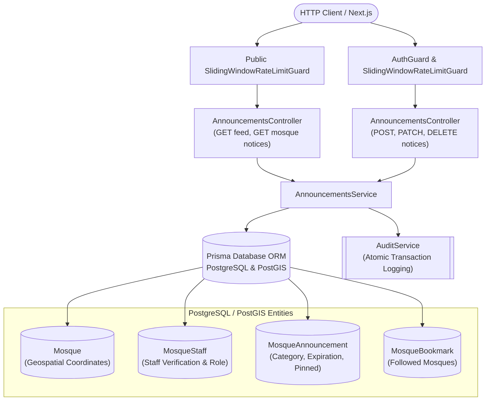

# Mosque Announcements Channel & Broadcast Feature Module

## Purpose
The `announcements` module manages verified congregational notices, Jumu'ah khutbah sermon topics, Janaza prayer schedules, emergency advisories, and area-wide announcement discovery across Bangladesh mosques.

---

## Component Architecture

### Component Source Map

| Component | Layer / Role | Relative Source Path |
| :--- | :--- | :--- |
| `AnnouncementsController` | HTTP Controller & Route Aliases | [`./announcements.controller.ts`](file:///home/chillpc/MohammadSheakh/projects/26/bd-moshjid/bd-moshjid-project/bd-moshjid-project/backend-nest-prisma/src/features/announcements/announcements.controller.ts) |
| `AnnouncementsService` | Domain Invariants & RBAC Logic | [`./announcements.service.ts`](file:///home/chillpc/MohammadSheakh/projects/26/bd-moshjid/bd-moshjid-project/bd-moshjid-project/backend-nest-prisma/src/features/announcements/announcements.service.ts) |
| `CreateAnnouncementDto` | Input Validation Schema | [`./dto/create-announcement.dto.ts`](file:///home/chillpc/MohammadSheakh/projects/26/bd-moshjid/bd-moshjid-project/bd-moshjid-project/backend-nest-prisma/src/features/announcements/dto/create-announcement.dto.ts) |
| `AuditService` | Immutable Audit Trail | [`../audit/audit.service.ts`](file:///home/chillpc/MohammadSheakh/projects/26/bd-moshjid/bd-moshjid-project/bd-moshjid-project/backend-nest-prisma/src/features/audit/audit.service.ts) |
| `PrismaService` | Database & PostGIS ORM | `@app/database` |

---

## Responsibilities
- Public retrieval of active announcements for individual mosques with category filtering.
- Filtering out expired notices on public reads while permitting verified staff inspection via `includeExpired=true`.
- Authorizing announcement creation and updates via verified `MosqueStaff` assignments (`F-020`).
- Gating high-consequence `EMERGENCY_ALERT` broadcasts strictly to `MOSQUE_ADMIN`, `COMMITTEE_PRESIDENT`, or platform admins.
- Enforcing the **maximum 3 pinned notices ceiling** to prevent UI clutter.
- Providing PostGIS radial discovery (`ST_DWithin`) and bookmarked mosque aggregated feeds.
- Capturing author role snapshots (`authorRole`) and writing atomic `AuditLog` records for every mutation.

## Does Not Own
- Staff onboarding and delegation vetting (owned by `src/features/community/`).
- Mosque spatial geometry mutation (owned by `src/features/mosques/`).
- Push notifications and BullMQ messaging (planned for Release 3).

## Database Ownership
- **Writes / Mutates**:
  - `MosqueAnnouncement`: Creates, updates, and deletes congregational notices.
  - `AuditLog`: Writes immutable audit rows inside `$transaction`.
- **Reads / References**:
  - `Mosque`: Validates existence and reads spatial coordinates (`longitude`, `latitude`).
  - `MosqueStaff`: Validates staff verification and role permissions.
  - `MosqueBookmark`: Filters followed mosque feeds.

---

## Domain Invariants
1. **Tiered Publishing Authority**: Unverified users and general worshippers cannot publish notices.
2. **Emergency Alert Privilege**: `EMERGENCY_ALERT` notices require executive mosque authority (`MOSQUE_ADMIN` or `COMMITTEE_PRESIDENT`) or global platform admins.
3. **Pin Ceiling**: A mosque can have at most **3 active pinned announcements** at any given moment.
4. **Historical Attribution**: When an announcement is created, the author's current role title is snapshotted into `authorRole`. If the author later resigns or is revoked, past notices retain their historical title.
5. **Zero-Extra-Infra Expiration**: Expiration is calculated purely in PostgreSQL parameterized queries: `WHERE (expiresAt IS NULL OR expiresAt > NOW())`.
