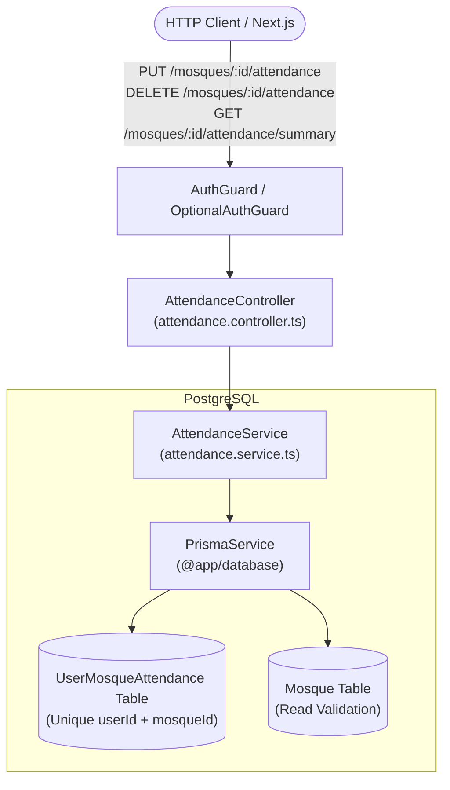
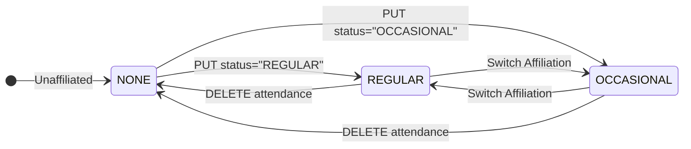

# Attendance Feature Module

## Purpose
The `attendance` module manages user congregational affiliations with local mosques. It provides idempotent endpoints for users to mark themselves as `REGULAR` or `OCCASIONAL` attendees or remove attendance, power community size indicators, and track personal bookmarked prayer locations.

---

## Component Architecture

### Component Source Map

| Component | Layer / Role | Relative Source Path |
| :--- | :--- | :--- |
| `AttendanceController` | HTTP Controller | [`./attendance.controller.ts`](./attendance.controller.ts) |
| `AttendanceService` | Domain Orchestration | [`./attendance.service.ts`](./attendance.service.ts) |
| `SetAttendanceDto` | Input DTO & Enum Validation | [`./dto/set-attendance.dto.ts`](./dto/set-attendance.dto.ts) |
| `PrismaService` | Database ORM | `@app/database` |

---

## State Machine: Attendance Lifecycle

---

## Domain Invariants

1. **Composite Uniqueness**: Exactly one attendance row exists per `(userId, mosqueId)` tuple via database unique constraint `@@unique([userId, mosqueId])`. Multiple simultaneous statuses for a single user at the same mosque are physically impossible.
2. **Idempotence**: Repeating a `PUT` with the same status or repeating a `DELETE` when no record exists returns a safe `200 OK` with the current aggregate summary without throwing errors or creating duplicate records.
3. **Soft-Deleted Mosque Exclusion**: Users cannot affiliate with soft-deleted mosques (`isDeleted: true`); attempts return `404 Not Found`.

---

## Database Ownership

| Table | Mutation Rights | Query Rights |
| :--- | :--- | :--- |
| `UserMosqueAttendance` | **Exclusive** (upsert, delete) | Read by `mosques` (aggregation), `attendance` |
| `Mosque` | None (read only) | Existence check |
| `User` | None (read only) | Relation foreign key |

---

## Brutal Honest Vulnerability Analysis

1. **Ghost Aggregation Inactive Bloat**: Over months or years, users who relocate or stop attending may leave stale attendance records in the database, inflating community count indicators.
   - *Mitigation strategy*: In Phase 3, implement an activity decay or quarterly re-confirmation prompt for `REGULAR` attendees.
2. **High-Concurrency Count Aggregation**: Under peak traffic, executing `count()` queries per mosque request on high-volume mosques can incur index contention on PostgreSQL.
   - *Mitigation strategy*: For Release 2+, introduce cached attendance counters on the `Mosque` record or Redis counter cache updated asynchronously.
