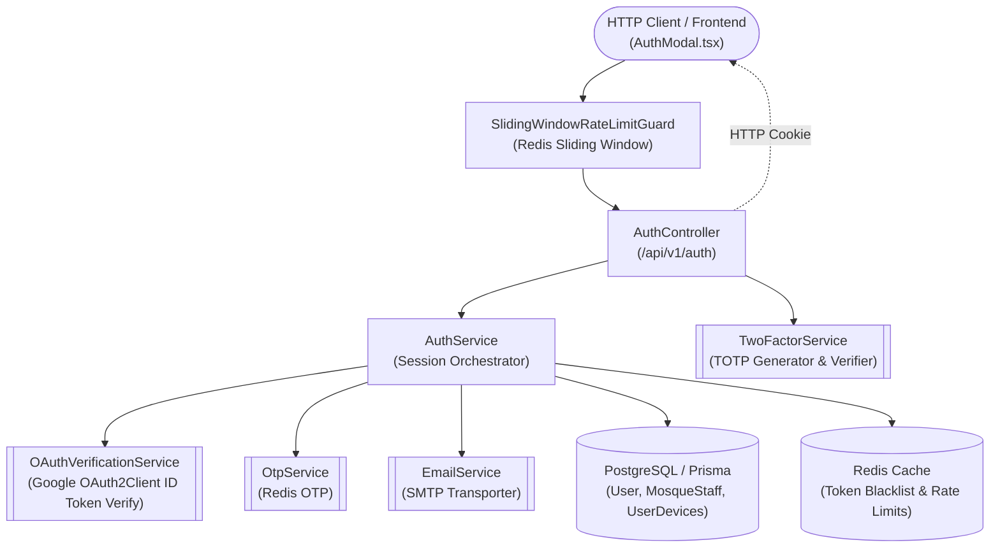
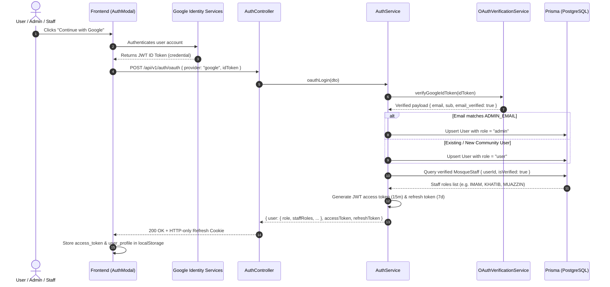

# Authentication & Identity Feature

## Purpose
Provides secure identity management, credential protection, Google OAuth 2.0 social login, multi-role session generation (Platform Admin, Mosque Staff/Committee, Community Visitors), TOTP two-factor authentication, and brute-force lockout defenses.

## Component Architecture

### Component Source Map

| Component | Layer / Role | Relative Source Path |
| :--- | :--- | :--- |
| `AuthController` | HTTP Controller & Cookie Lifecycle | [`./auth/auth.controller.ts`](file:///home/chillpc/MohammadSheakh/projects/26/bd-moshjid/bd-moshjid-project/bd-moshjid-project/backend-nest-prisma/src/features/authentication/auth/auth.controller.ts) |
| `AuthService` | Identity Orchestration & Role Resolution | [`./auth/auth.service.ts`](file:///home/chillpc/MohammadSheakh/projects/26/bd-moshjid/bd-moshjid-project/bd-moshjid-project/backend-nest-prisma/src/features/authentication/auth/auth.service.ts) |
| `OAuthVerificationService` | Google ID Token Cryptographic Verification | [`./oauth/oauth-verification.service.ts`](file:///home/chillpc/MohammadSheakh/projects/26/bd-moshjid/bd-moshjid-project/bd-moshjid-project/backend-nest-prisma/src/features/authentication/oauth/oauth-verification.service.ts) |
| `TwoFactorService` | TOTP Setup, Secrets & Recovery Codes | [`./two-factor/two-factor.service.ts`](file:///home/chillpc/MohammadSheakh/projects/26/bd-moshjid/bd-moshjid-project/bd-moshjid-project/backend-nest-prisma/src/features/authentication/two-factor/two-factor.service.ts) |
| `OtpService` | Short-lived Email Verification OTPs | [`./otp/otp.service.ts`](file:///home/chillpc/MohammadSheakh/projects/26/bd-moshjid/bd-moshjid-project/bd-moshjid-project/backend-nest-prisma/src/features/authentication/otp/otp.service.ts) |
| `EmailService` | Transactional Email Dispatch | [`./email/email.service.ts`](file:///home/chillpc/MohammadSheakh/projects/26/bd-moshjid/bd-moshjid-project/bd-moshjid-project/backend-nest-prisma/src/features/authentication/email/email.service.ts) |

---

## Responsibilities
- Verifying Google OAuth 2.0 ID tokens cryptographically against Google's public keys and registered `GOOGLE_CLIENT_ID`.
- Elevating accounts matching configured `ADMIN_EMAIL` to `UserRole.admin`.
- Associating mosque staff members with their verified `MosqueStaff` roles in authenticated session responses.
- Enforcing password complexity and salted bcrypt hashing (`BCRYPT_SALT_ROUNDS=12`).
- Short-lived JWT access tokens (`15m`) and rotating refresh tokens (`7d`) with Redis blacklisting.
- Defending against brute-force attacks via sliding-window rate limiters and temporary account lockout.

## Does Not Own
- Mosque entity lifecycle management (owned by `features/mosques`).
- Community staff invitation approvals and role claims verification (owned by `features/community` & `features/admin`).
- Push notification delivery via FCM (owned by `features/notifications`).

---

## Database Ownership
- **Writes / Mutates**:
  - `User`: Creates registered accounts; updates `isEmailVerified`, `profileImageUrl`, `role`, `failedLoginAttempts`, `lockUntil`, and 2FA secrets.
  - `UserDevices`: Registers active device tokens and FCM push addresses.
- **Reads / References**:
  - `MosqueStaff`: Queries verified staff positions (`userId`, `isVerified: true`) to embed active roles in session payloads.
  - `Mosque`: Reads mosque name and city for staff association context.

---

## Important Invariants
1. **Never Persist or Log Plaintext Credentials**: Passwords, OTP codes, and private tokens are filtered by `LogSanitizer` before reaching structured logs.
2. **Mandatory Google Email Verification**: Accounts authenticated through Google OAuth are strictly rejected if `payload.email_verified !== true`.
3. **Transaction Boundary for Account Creation / Upgrade**: Account lookup, role elevation, and creation occur inside atomic `this.prisma.$transaction` blocks.
4. **Strict Audience Isolation**: Admin routes require validated `UserRole.admin` or `UserRole.moderator`.

---

## Public API & Entry Points

| Method | Endpoint | Description | Rate Limit |
| :--- | :--- | :--- | :--- |
| `GET` | `/api/v1/auth/oauth/config` | Exposes public `googleClientId` for web clients | User preset (30/min) |
| `POST` | `/api/v1/auth/oauth` | Google OAuth login via verified ID token | Auth preset (5/15min) |
| `POST` | `/api/v1/auth/login` | Email/password login with lockout tracking | Auth preset (5/15min) |
| `POST` | `/api/v1/auth/register` | New community account registration | Strict preset (10/min) |
| `POST` | `/api/v1/auth/refresh` | Access token rotation via refresh token | Auth preset (5/15min) |
| `POST` | `/api/v1/auth/logout` | Revokes refresh token and blacklists in Redis | General |
| `POST` | `/api/v1/auth/2fa/*` | TOTP generation, validation, and recovery | Strict preset |

---

## Important Flows

### Google OAuth 2.0 & Multi-Role Session Sequence

---

## Honest Vulnerability & Zero-Day Analysis

1. **Email Domain Spoofing Defense**:
   - *Risk*: A rogue user registers an arbitrary Gmail address attempting to claim the admin role.
   - *Mitigation*: The backend requires cryptographic verification from `oauth2Client.verifyIdToken`. Google's signature prevents email forgery, and the backend verifies `email_verified === true`.
2. **Clock Drift on Google ID Tokens**:
   - *Risk*: Desynchronized servers may reject valid Google tokens or accept expired ones.
   - *Mitigation*: Handled by `google-auth-library` default clock tolerance window (up to 300 seconds).
3. **Account Takeover via Pre-existing Local Email**:
   - *Risk*: If a malicious actor registered an unverified local account with the admin's email before the admin signs in with Google.
   - *Mitigation*: When the true owner signs in with verified Google OAuth, the system verifies `email_verified === true`, links the identity, and upgrades the role securely.
