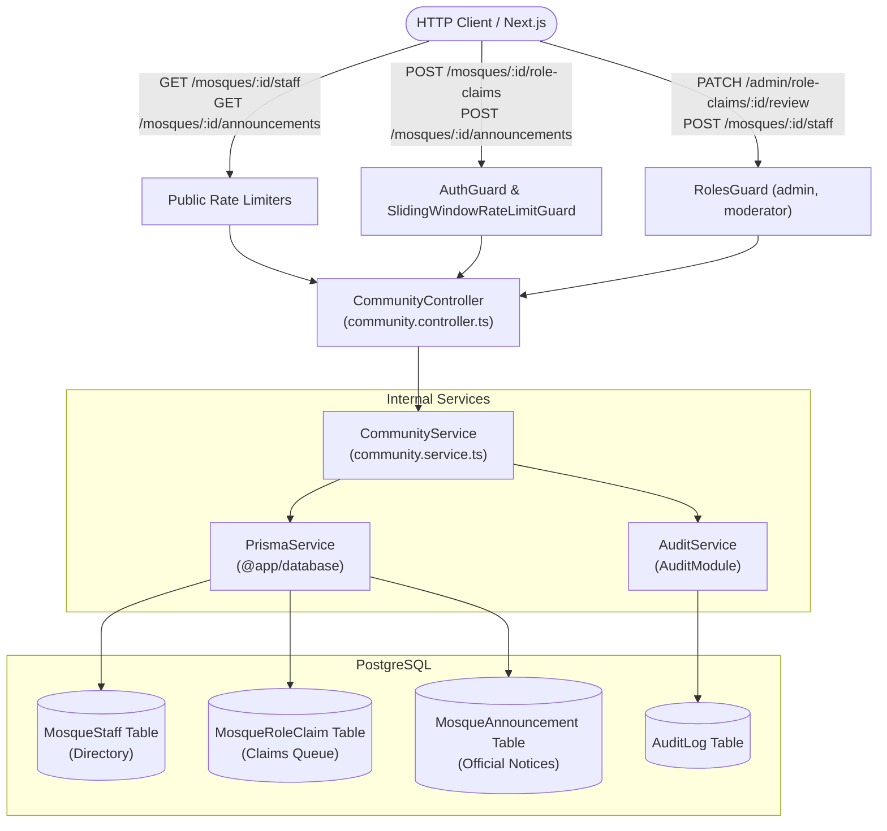
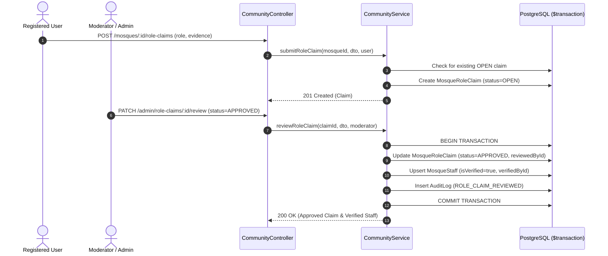

# Mosque Community, Roles & Announcements Feature Module

## Purpose
The `community` module manages verified mosque personnel directories (Imams, Muazzins, Khatibs, Khadems, Committee Executives), role claim vetting pipelines, mosque-scoped publishing authorizations, and official congregational announcements.

---

## Component Architecture

### Component Source Map

| Component | Layer / Role | Relative Source Path |
| :--- | :--- | :--- |
| `CommunityController` | HTTP Controller | [`./community.controller.ts`](./community.controller.ts) |
| `CommunityService` | Domain Orchestration | [`./community.service.ts`](./community.service.ts) |
| `AddStaffDto` | Staff Input Validator | [`./dto/add-staff.dto.ts`](./dto/add-staff.dto.ts) |
| `CreateRoleClaimDto` | Role Claim Submission | [`./dto/create-claim.dto.ts`](./dto/create-claim.dto.ts) |
| `ReviewRoleClaimDto` | Moderation Review DTO | [`./dto/review-claim.dto.ts`](./dto/review-claim.dto.ts) |
| `CreateAnnouncementDto` | Announcement Content DTO | [`./dto/create-announcement.dto.ts`](./dto/create-announcement.dto.ts) |
| `AuditService` | Audit Trail | [`../audit/audit.service.ts`](../audit/audit.service.ts) |

---

## Role Claim Verification Sequence

---

## Domain Invariants

1. **Anti-Duplication Claim Barrier**: A user cannot have multiple simultaneous `OPEN` or `UNDER_REVIEW` claims for the same role at the same mosque.
2. **Atomic Verification Elevation**: Approving a role claim MUST automatically provision or promote a verified `MosqueStaff` record and record an audit log within the same database transaction (`$transaction`).
3. **Mosque-Scoped Announcement Authorization**: Non-admin users can ONLY publish announcements for a mosque if they are a verified staff member (`isVerified: true`) for that specific mosque.
4. **Cascade Safety**: Deleting a mosque cascades to delete associated staff directory entries, pending role claims, and announcements.

---

## Database Ownership

| Table | Mutation Rights | Query Rights |
| :--- | :--- | :--- |
| `MosqueStaff` | **Exclusive** (create, delete, verify) | Public read directory |
| `MosqueRoleClaim` | **Exclusive** (create, status review) | Admin / submitter read |
| `MosqueAnnouncement` | **Exclusive** (create, delete) | Public read announcements |
| `AuditLog` | Appends audit event | Security and audit logging |
| `Mosque` | None (read only) | Existence checks |

---

## Brutal Honest Vulnerability Analysis

1. **False Role Claim Exploitation**: An impostor could submit fabricated appointment documents to gain announcement and schedule publishing authority.
   - *Mitigation strategy*: Role claims strictly require admin or moderator manual verification (`RoleClaimStatus.APPROVED`). Unreviewed claims grant zero operational or editing permissions.
2. **Pinned Announcement Clutter**: Multiple pinned announcements can take over screen space on mobile viewports.
   - *Mitigation strategy*: Frontend limits display to the 2 most recent pinned announcements, and backend limits pinning to verified staff or admins.
