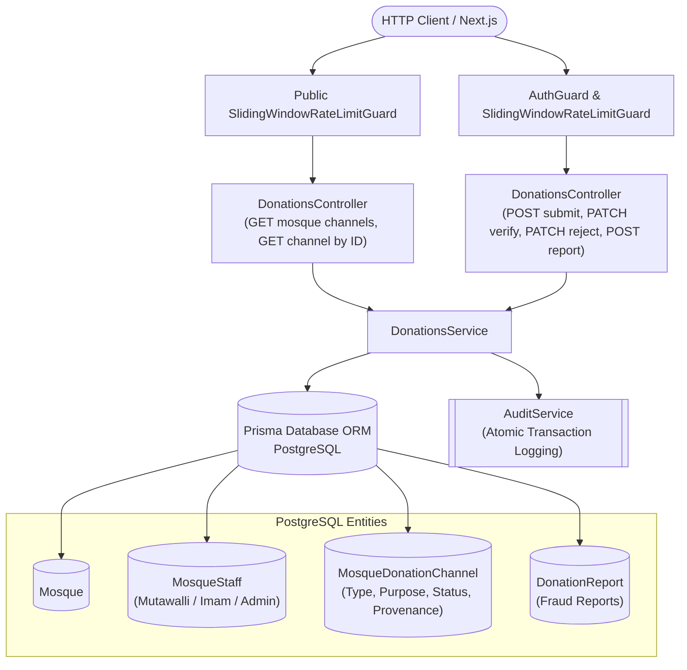

# Verified Mosque Donation Information & Fraud Prevention Feature Module

## Purpose
The `donations` module manages verified digital and banking collection channels (bKash, Nagad, Rocket, Upay, Bank Transfer) for mosques across Bangladesh, enforcing a decentralized two-person verification rule to prevent financial fraud.

---

## Component Architecture

### Component Source Map

| Component | Layer / Role | Relative Source Path |
| :--- | :--- | :--- |
| `DonationsController` | HTTP Controller & REST Endpoints | [`./donations.controller.ts`](file:///home/chillpc/MohammadSheakh/projects/26/bd-moshjid/bd-moshjid-project/bd-moshjid-project/backend-nest-prisma/src/features/donations/donations.controller.ts) |
| `DonationsService` | Two-Person Verification & Domain Invariants | [`./donations.service.ts`](file:///home/chillpc/MohammadSheakh/projects/26/bd-moshjid/bd-moshjid-project/bd-moshjid-project/backend-nest-prisma/src/features/donations/donations.service.ts) |
| `CreateDonationChannelDto` | Submission Validation Schema | [`./dto/create-donation-channel.dto.ts`](file:///home/chillpc/MohammadSheakh/projects/26/bd-moshjid/bd-moshjid-project/bd-moshjid-project/backend-nest-prisma/src/features/donations/dto/create-donation-channel.dto.ts) |
| `AuditService` | Immutable Audit Trail Logging | [`../audit/audit.service.ts`](file:///home/chillpc/MohammadSheakh/projects/26/bd-moshjid/bd-moshjid-project/bd-moshjid-project/backend-nest-prisma/src/features/audit/audit.service.ts) |
| `PrismaService` | Database ORM | `@app/database` |

---

## Responsibilities
- Public retrieval of `VERIFIED` donation channels for individual mosques.
- Filtering out unverified/pending channels on public queries while permitting verified staff inspection.
- Enforcing two-person verification rule: Submitter must be verified Mutawalli/Committee; Verifier must be verified Imam/Admin.
- Blocking self-approval attempts with `403 Forbidden` (`CANNOT_APPROVE_OWN_SUBMISSION`).
- Recording community fraud reports with dispute counter increments without enabling griefing takedowns.
- Capturing verification provenance (`verifiedById`, `verifiedAt`) and writing atomic `AuditLog` records for every state mutation.

## Does Not Own
- Direct payment gateway processing or financial escrow (the platform is a verified directory, not a payment aggregator).
- Mosque staff onboarding and claim review (owned by `src/features/community/`).

## Database Ownership
- **Writes / Mutates**:
  - `MosqueDonationChannel`: Creates draft channels, updates verification status, records rejection reasons.
  - `DonationReport`: Logs user fraud and error reports.
  - `AuditLog`: Writes immutable audit rows inside `$transaction`.
- **Reads / References**:
  - `Mosque`: Validates existence.
  - `MosqueStaff`: Validates staff verification and role permissions.

---

## Domain Invariants
1. **Two-Person Verification Invariant (Separation of Duty)**: The verifier cannot be the user who submitted the channel (`verifiedById !== createdById`).
2. **Staff-Only Submissions**: General users cannot submit donation channels.
3. **Imam / Admin Verification**: Only verified Imams or Mosque Admins can verify channels.
4. **Anti-Griefing Reporting**: Community reports increment `disputeCount` and record `DonationReport` without unpublishing the channel.
5. **Zero-Extra-Infra Persistence**: All channel queries, filtering, and provenance reside purely in PostgreSQL B-tree indexed tables.
