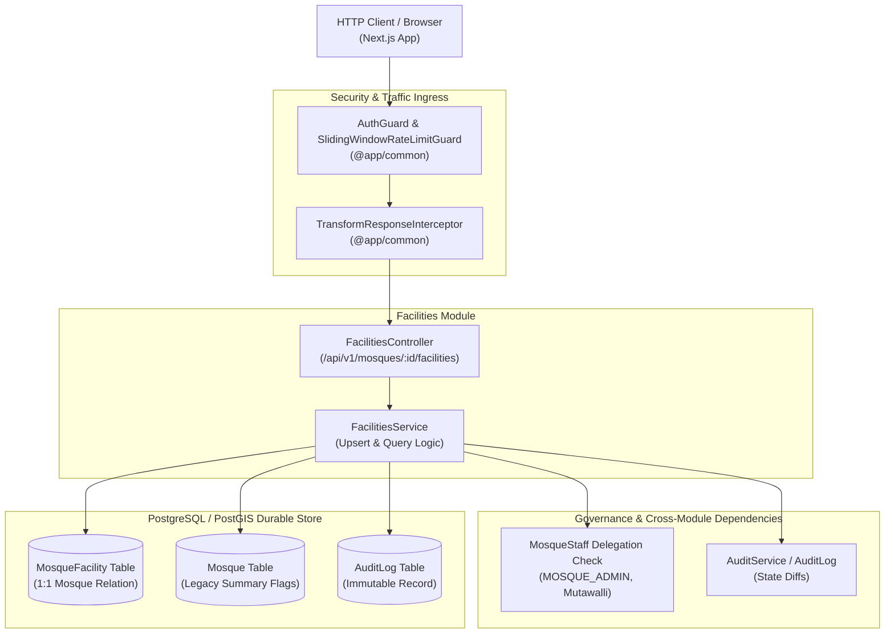
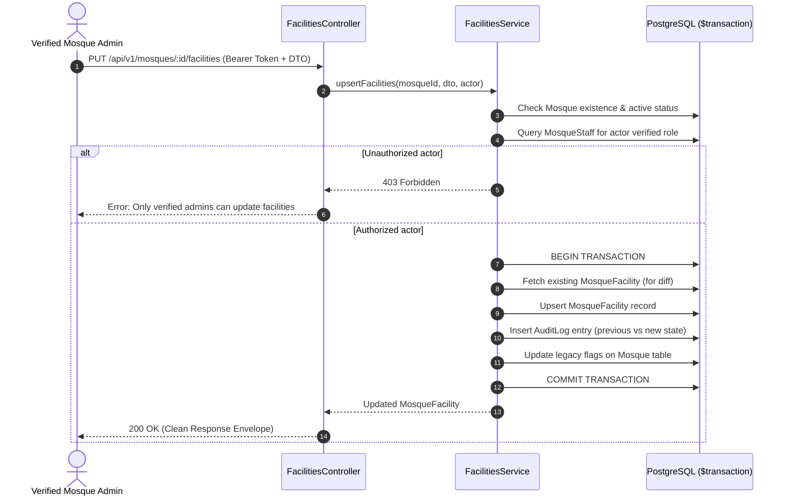

# Mosque Facilities & Accessibility Taxonomy

## Purpose
Manages canonical physical infrastructure, Musalli capacity, ablution provisions, accessibility accommodations, and climate controls for mosques. Enforces strict single-tenant spatial indexing, tiered mutation governance, and transactional audit tracking.

## Component Architecture

## Business Invariants & Rules

1. **Strict 1:1 Cardinality**: Every `Mosque` entity can have at most one associated `MosqueFacility` record. Deleting a mosque cascades to delete its facility record (`onDelete: Cascade`).
2. **Tiered Mutation Governance**: Only verified `MOSQUE_ADMIN`, `COMMITTEE_PRESIDENT`, `COMMITTEE_MEMBER`, `MUTAWALLI` of that specific mosque, or global platform `admin`/`moderator` accounts can modify facility data. General Musallis submit amendments via the crowdsourced suggestion pipeline (`F-006`).
3. **Atomic Audit Logging**: Every create or update operation must record an immutable `AuditLog` row capturing actor, previous state, and updated state inside an atomic PostgreSQL `$transaction`.
4. **Visible Unknowns Policy**: Unreported integer and boolean attributes remain `null` rather than artificially defaulted to `false` or `0`.
5. **Backwards Compatibility**: Updating `MosqueFacility` automatically updates the legacy summary booleans on `Mosque` (`hasAirConditioning`, `hasSeparateWomenSpace`, `hasWheelchairAccess`, `capacity`) within the same transaction.

## Database Ownership

| Model / Table | Access Mode | Description |
| :--- | :--- | :--- |
| `MosqueFacility` | **Owner (Read/Write)** | Primary canonical facilities, capacity, accessibility, and climate record |
| `Mosque` | Read / Update | Read mosque existence; sync legacy boolean summary flags |
| `MosqueStaff` | Read | Verify local administrative permissions (`MOSQUE_ADMIN`, committee) |
| `AuditLog` | Append-Only | Record full state transition diffs on upsert |

## Request Sequence: Facility Upsert

