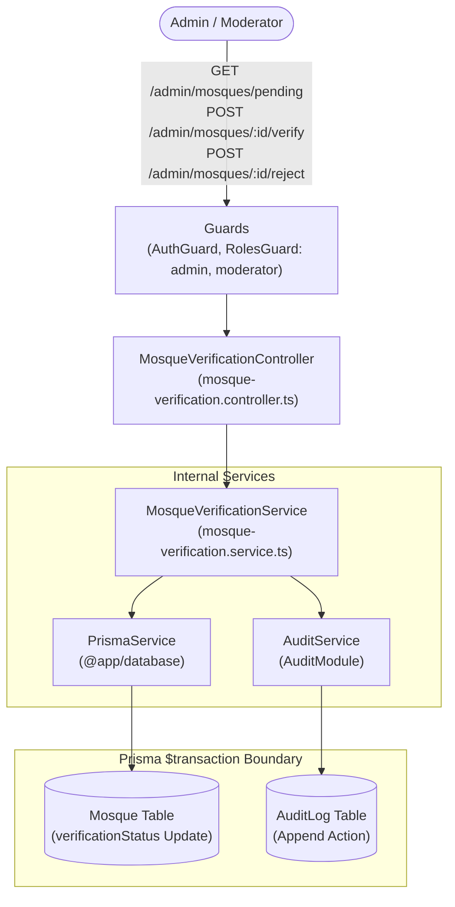
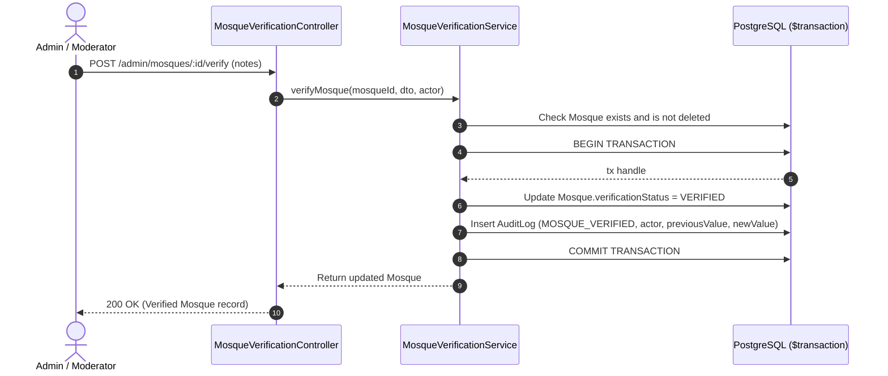

# Mosque Verification Feature Module

## Purpose
The `mosque-verification` module governs the administrative vetting and trust tiering of mosque listings. It provides authorized moderators and administrators with endpoints to review pending submissions, approve mosques into `VERIFIED` status, or flag listings as `REJECTED` with recorded justifications and audit trails.

---

## Component Architecture

### Component Source Map

| Component | Layer / Role | Relative Source Path |
| :--- | :--- | :--- |
| `MosqueVerificationController` | HTTP Controller | [`./mosque-verification.controller.ts`](./mosque-verification.controller.ts) |
| `MosqueVerificationService` | Domain Orchestration | [`./mosque-verification.service.ts`](./mosque-verification.service.ts) |
| `VerifyMosqueDto` | Approval Notes DTO | [`./dto/verification.dto.ts`](./dto/verification.dto.ts) |
| `RejectMosqueDto` | Rejection Reason DTO | [`./dto/verification.dto.ts`](./dto/verification.dto.ts) |
| `AuditService` | Audit Logging | [`../audit/audit.service.ts`](../audit/audit.service.ts) |
| `PrismaService` | Database ORM | `@app/database` |

---

## Verification Lifecycle Sequence

---

## Domain Invariants

1. **Strict RBAC Enforcement**: Only users with role `admin` or `moderator` can invoke verification endpoints (`@Roles('admin', 'moderator')`).
2. **Atomic Audit Logging**: Modifying `verificationStatus` MUST occur within an atomic `$transaction` that appends a `MOSQUE_VERIFIED` or `MOSQUE_REJECTED` event to `AuditLog`.
3. **Operational Independence**: A mosque's `verificationStatus` (`VERIFIED`, `UNVERIFIED`, `REJECTED`) is completely independent from its `operationalStatus` (`OPEN`, `TEMPORARILY_CLOSED`, `PERMANENTLY_CLOSED`). A verified mosque may still be temporarily closed for renovations.

---

## Database Ownership

| Table | Mutation Rights | Query Rights |
| :--- | :--- | :--- |
| `Mosque` | Updates `verificationStatus` | Query pending queue (`UNVERIFIED`, `PENDING_VERIFICATION`) |
| `AuditLog` | Appends audit event | Verification history & accountability |
| `User` | None | Actor attribution |

---

## Brutal Honest Vulnerability Analysis

1. **Moderator Bias or Rogue Approval**: A compromised moderator account could verify fraudulent or spam mosques en masse.
   - *Mitigation strategy*: All verification actions record the moderator's `actor.userId` in immutable `AuditLog`. Admins can query audit logs and bulk-revert modifications made by a specific actor.
2. **Rejection Notification Gap**: In Release 1, rejecting a mosque sets `REJECTED` status in the database, but does not yet trigger an email notification to the original submitter explaining why the listing was rejected.
   - *Mitigation strategy*: Connect `EmailService` to dispatch rejection feedback in Phase 2 once submitter email capture is made mandatory.
