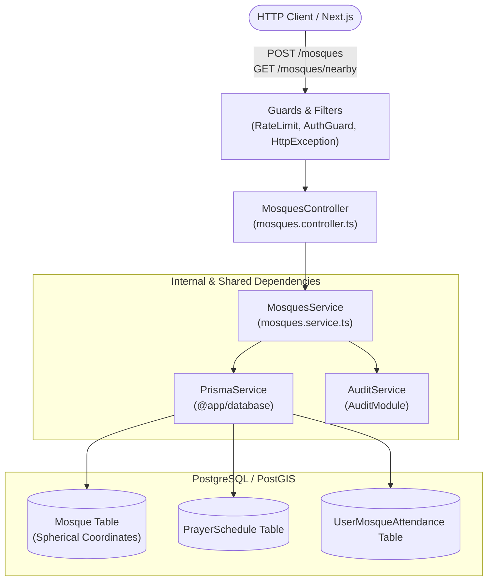
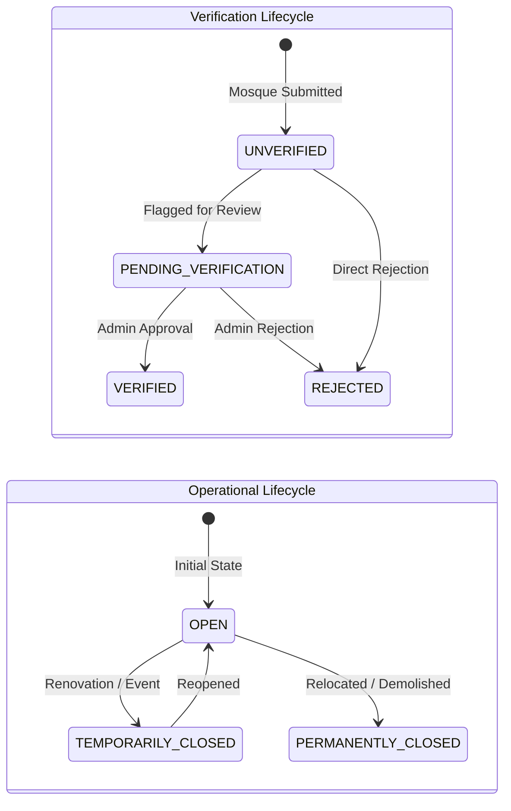

# Mosques Feature Module

## Purpose
The `mosques` module serves as the core spatial registry for the Mosque Information & Community Platform. It owns mosque registration, coordinate validation, proximity duplicate candidate detection, bounding-box spatial queries, and dynamic information freshness derivation.

---

## Component Architecture

---

## State Machine: Dual-Status Separation

Operational state and verification status are strictly decoupled dimensions:

---

## Domain Invariants

1. **50-Meter Proximity Duplicate Barrier**: Any creation attempt within `MOSQUE_CONSTANTS.DUPLICATE_CHECK_RADIUS_METERS` (50m) of an existing mosque must be rejected with `MOSQUE_POSSIBLE_DUPLICATE` (HTTP 409) unless `allowDuplicateWarningBypass: true` is explicitly provided.
2. **Dynamic Information Freshness**: Freshness is strictly derived dynamically from `PrayerSchedule.updatedAt` or `Mosque.updatedAt`. It must never be stored as a static column or color in the database.
   - `FRESH`: updated `< 90 days` ago.
   - `STALE`: updated `90 - 180 days` ago.
   - `VERY_STALE`: updated `> 180 days` ago or schedule missing.
3. **Bounding-Box Index Guard**: All nearby distance queries must pre-filter with a latitude/longitude bounding-box range check before calculating the expensive spherical Haversine arc to protect CPU under concurrent load.
4. **Soft-Delete Exclusivity**: Deleted mosques (`isDeleted: true`) are never returned in nearby queries or duplicate checks.

---

## Database Ownership

| Table | Mutation Rights | Query Rights |
| :--- | :--- | :--- |
| `Mosque` | **Exclusive** (create, update, soft-delete) | Read by all modules |
| `PrayerSchedule` | Read & Initial creation | Primary mutation owned by `prayer-schedules` |
| `UserMosqueAttendance` | Read-only aggregate counts | Mutated by `attendance` module |
| `AuditLog` | Appends audit events | Read by admin / compliance |

---

## Brutal Honest Vulnerability Analysis

1. **Concurrent Duplicate Race Window**: If two users submit mosques at the exact same location concurrently within milliseconds, both may pass the read check before either record commits.
   - *Mitigation strategy*: Add a PostGIS spatial exclusion constraint or database-level advisory locking on spatial grid cells for high-throughput releases.
2. **Coordinate Jitter Abuse**: A malicious actor could shift coordinates by 51 meters to bypass the 50m duplicate detection.
   - *Mitigation strategy*: Multi-scale candidate search (50m hard barrier, 200m advisory warning) and IP/user submission rate limiting.
3. **Polar Latitude Bounding-Box Edge Case**: At extreme latitudes, degree delta calculations distort.
   - *Assessment*: Bangladesh coordinates are constrained within `20.5° N` to `26.6° N` and `88.0° E` to `92.7° E`, where cosine projection error is negligible (<1%).
