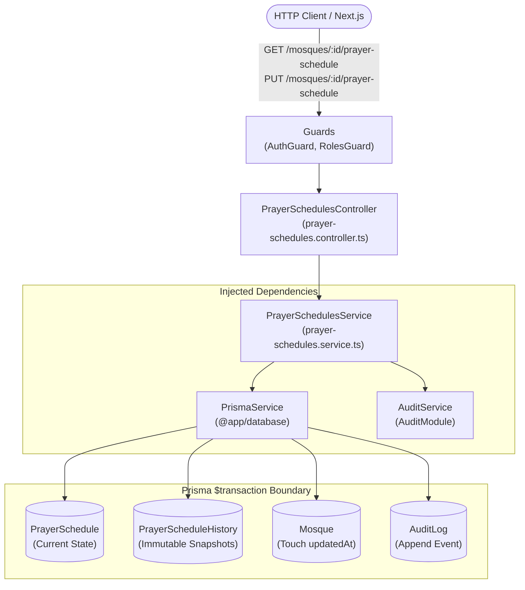
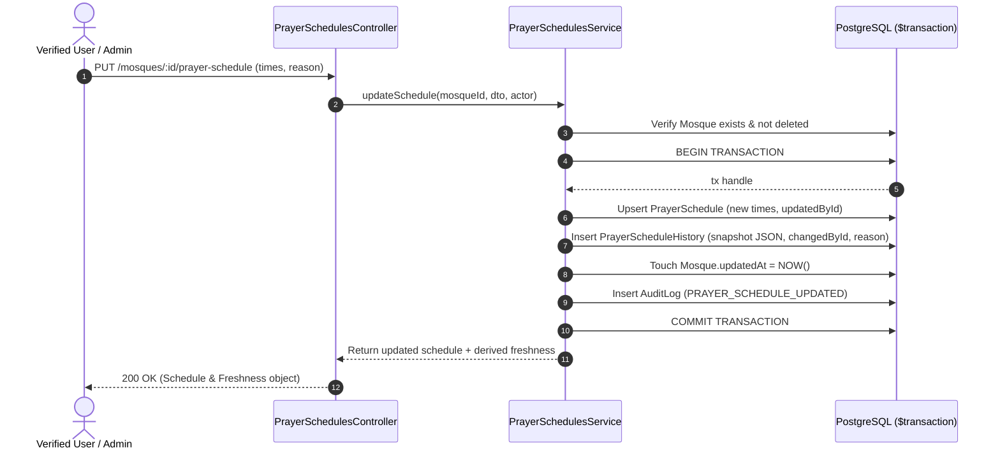

# Prayer Schedules Feature Module

## Purpose
The `prayer-schedules` module manages daily 5-prayer (Fajr, Dhuhr, Asr, Maghrib, Isha) and Jumu'ah congregational (Jamaat) timetables. It enforces atomic timetable mutations alongside immutable versioned history snapshots (`PrayerScheduleHistory`) and real-time freshness derivation.

---

## Component Architecture

### Component Source Map

| Component | Layer / Role | Relative Source Path |
| :--- | :--- | :--- |
| `PrayerSchedulesController` | HTTP Controller | [`./prayer-schedules.controller.ts`](./prayer-schedules.controller.ts) |
| `PrayerSchedulesService` | Domain Orchestration | [`./prayer-schedules.service.ts`](./prayer-schedules.service.ts) |
| `UpdatePrayerScheduleDto` | DTO & HH:mm Validator | [`./dto/update-prayer-schedule.dto.ts`](./dto/update-prayer-schedule.dto.ts) |
| `AuditService` | Audit Logging | [`../audit/audit.service.ts`](../audit/audit.service.ts) |
| `PrismaService` | Database ORM | `@app/database` |

---

## Request & Execution Sequence: Schedule Mutation

---

## Domain Invariants

1. **Transactional Atomicity**: Any update to `PrayerSchedule` MUST snapshot into `PrayerScheduleHistory` and record an `AuditLog` within the same database transaction (`$transaction`). If any step fails, all mutations roll back.
2. **Freshness Derivation**: Freshness is calculated on-the-fly from the updated timestamp:
   - `FRESH`: `< 90 days` old
   - `STALE`: `90 - 180 days` old
   - `VERY_STALE`: `> 180 days` old or null
3. **Immutable History**: Records in `PrayerScheduleHistory` are append-only and cannot be updated or deleted by normal application workflows.
4. **Time Format Integrity**: Prayer times must adhere to the `HH:mm` format string constraint or null for optional fields (e.g. sunrise, makrooh).

---

## Database Ownership

| Table | Mutation Rights | Query Rights |
| :--- | :--- | :--- |
| `PrayerSchedule` | **Exclusive** (upsert) | Read by `mosques`, `prayer-schedules` |
| `PrayerScheduleHistory` | **Exclusive** (append-only) | Read by audit & history endpoints |
| `Mosque` | Touches `updatedAt` | Read-only verification |
| `AuditLog` | Appends audit event | Admin and audit consumers |

---

## Brutal Honest Vulnerability Analysis

1. **Rapid Time Churn / Vandalism Risk**: A malicious user with update privileges could repeatedly update schedule times to flood `PrayerScheduleHistory` and degrade disk space.
   - *Mitigation strategy*: Apply per-mosque rate limiting on PUT endpoints (e.g. max 5 updates per 24 hours per non-admin contributor).
2. **No Daylight Saving / Astronomical Sanity Validation**: The current DTO checks `HH:mm` format with regex, but does not strictly validate whether Fajr is before Sunrise or Maghrib is before Isha according to astronomical bounds for Bangladesh.
   - *Mitigation strategy*: Introduce an astronomical sanity guard in Phase 2 comparing submitted times against solar calculation models (e.g. Adhan/Umm Al-Qura algorithms adapted for BD latitudes).
