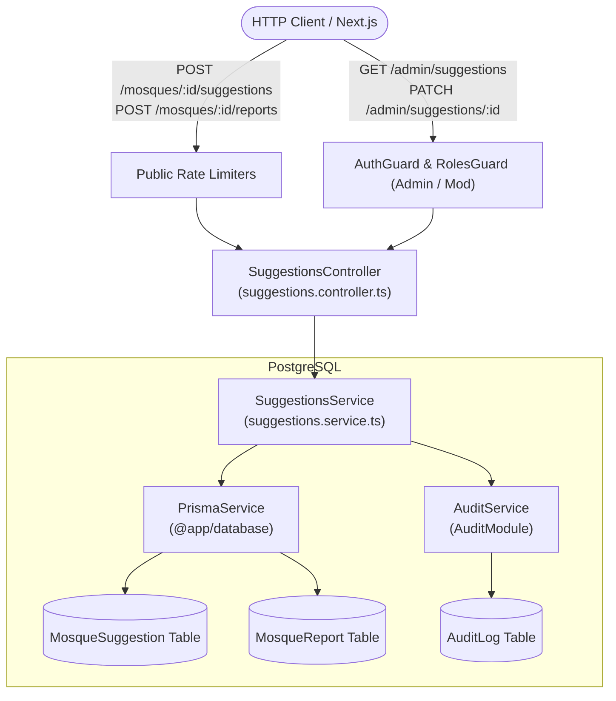
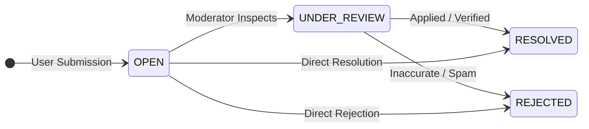

# Suggestions & Reports Feature Module

## Purpose
The `suggestions` module empowers community-driven feedback loops. It allows public and registered users to propose prayer timetable updates, flag discrepancies (duplicate, permanently closed, incorrect location), and provides an administrative moderation pipeline with review audit trails.

---

## Component Architecture

### Component Source Map

| Component | Layer / Role | Relative Source Path |
| :--- | :--- | :--- |
| `SuggestionsController` | HTTP Controller | [`./suggestions.controller.ts`](./suggestions.controller.ts) |
| `SuggestionsService` | Domain Orchestration | [`./suggestions.service.ts`](./suggestions.service.ts) |
| `CreateSuggestionDto` | Suggestion DTO | [`./dto/create-suggestion.dto.ts`](./dto/create-suggestion.dto.ts) |
| `CreateReportDto` | Report DTO & Type Validation | [`./dto/create-report.dto.ts`](./dto/create-report.dto.ts) |
| `UpdateStatusDto` | Review & Status DTO | [`./dto/update-status.dto.ts`](./dto/update-status.dto.ts) |
| `AuditService` | Audit Trail | [`../audit/audit.service.ts`](../audit/audit.service.ts) |
| `PrismaService` | Database ORM | `@app/database` |

---

## State Machine: Suggestion & Report Resolution

---

## Domain Invariants

1. **Decoupled Moderation Queue**: Community suggestions and reports never directly mutate operational mosque records or published prayer schedules automatically. Every submission remains in `OPEN` state until reviewed by a privileged actor (`admin` or `moderator`).
2. **Review Accountability**: Every status transition (`OPEN` -> `RESOLVED` / `REJECTED`) records the `reviewedById`, `reviewedAt` timestamp, resolution notes, and an immutable entry in `AuditLog`.
3. **Optional User Attribution**: Submissions accept unauthenticated community feedback with nullable `userId`, allowing broad community participation while retaining user IDs when authenticated.

---

## Database Ownership

| Table | Mutation Rights | Query Rights |
| :--- | :--- | :--- |
| `MosqueSuggestion` | **Exclusive** (create, status update) | Read by moderation endpoints |
| `MosqueReport` | **Exclusive** (create, status update) | Read by moderation endpoints |
| `AuditLog` | Appends audit event | Compliance & history tracking |
| `Mosque` | None (read only) | Existence check |

---

## Brutal Honest Vulnerability Analysis

1. **Anonymous Spam & Defamation Vector**: Unauthenticated users could flood the `MosqueReport` table with derogatory remarks or fake closure reports.
   - *Mitigation strategy*: Enforce strict IP sliding-window rate limiting on suggestion/report endpoints, sanitize string inputs with XSS filtering, and flag repeat IPs for automatic captcha challenges.
2. **Moderation Backlog Bottleneck**: If hundreds of suggestions accumulate without admin attention, user trust drops.
   - *Mitigation strategy*: In Release 2, implement daily digest email alerts to moderators for pending open suggestions older than 48 hours.
